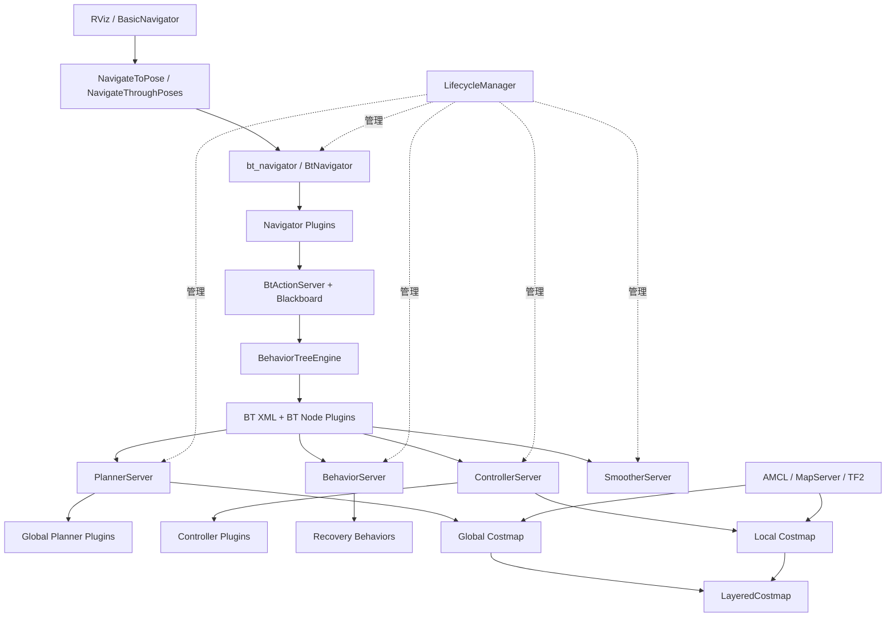
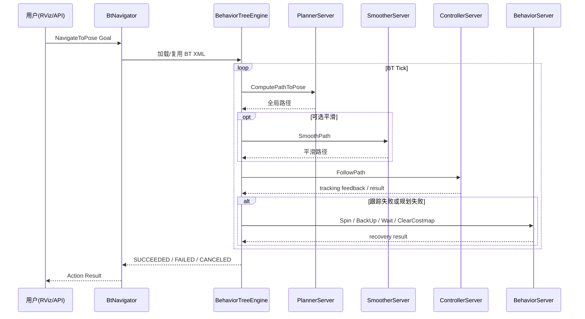
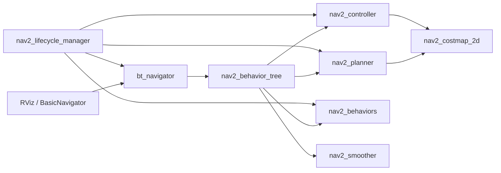

# Navigation2 (Nav2) 专业学习指南

> 生成时间：2026-03-27
> 项目仓库：https://github.com/ros-navigation/navigation2
> 目标读者：专业版 / Advanced
> 聚焦主题：行为树使用方式、核心组件、常用功能、原理与源码切入路径

---

## 目录
- [项目概述](#项目概述)
- [快速开始](#快速开始)
- [核心架构](#核心架构)
- [核心模块拆解](#核心模块拆解)
- [行为树使用方式](#行为树使用方式)
- [常用功能与典型调用链](#常用功能与典型调用链)
- [技术栈分析](#技术栈分析)
- [设计理念](#设计理念)
- [核心概念](#核心概念)
- [典型使用场景](#典型使用场景)
- [最佳实践与常见陷阱](#最佳实践与常见陷阱)
- [学习路径建议](#学习路径建议)
- [源码阅读目标问题清单](#源码阅读目标问题清单)
- [参考资源](#参考资源)
- [总结](#总结)

---

## 项目概述

### 项目简介
Navigation2 是 ROS 2 生态中最核心的移动机器人导航框架之一。它不是“一个规划算法”，而是一套**由行为树驱动的导航编排系统**：上层通过行为树决定何时规划、何时跟踪、何时恢复；中层通过 Planner / Controller / Behavior / Smoother 等服务器执行具体任务；下层通过 Costmap、TF、定位与消息接口提供世界模型和实时状态。

### 解决的问题
Nav2 主要解决四个连续问题：

1. 机器人**当前在哪里**。
2. 环境里**哪些区域可走、哪些不可走**。
3. 从当前位置到目标点**应如何规划全局路径**。
4. 如何在动态环境中**稳定、连续、安全地跟踪该路径**。

### 适用场景
- 室内服务机器人单点导航与多点巡航
- 仓储 AMR 的路径规划、路径跟踪与恢复
- 仿真环境中的导航算法验证与性能调优
- 需要插件化替换规划器 / 控制器 / BT 节点的工程项目
- 需要将业务逻辑映射到导航策略的复杂机器人系统

### 先建立正确心智模型
- **Nav2 = 编排层 + 服务器层 + 算法插件层 + 世界模型层**，不是一个单体节点。
- **行为树负责决策，不负责算路径也不负责输出速度**；真正算路径的是 Planner，真正出 `cmd_vel` 的是 Controller。
- 多数需求应优先考虑在 **参数 YAML、BT XML、插件层** 修改，而不是直接改 `BtNavigator` 核心代码。

---

## 快速开始

### 环境要求
- ROS 2（README 标注支持多个发行版，常见为 `humble` / `jazzy` / `kilted`）
- 已具备 ROS 2 Action、Lifecycle、TF2、Costmap 基础认知
- 需要 `colcon` 工作流与基础 Gazebo / RViz 使用经验

### 从源码构建
```bash
mkdir -p ~/nav2_ws/src
cd ~/nav2_ws/src
git clone https://github.com/ros-navigation/navigation2
cd ~/nav2_ws
colcon build --symlink-install
source install/setup.bash
```

关键依据：`README.md:10`、`/tmp/navigation2_wiki_contents.txt:1802`。

### 启动默认仿真路径
```bash
ros2 launch turtlebot3_gazebo turtlebot3_world.launch.py
ros2 launch nav2_bringup bringup_launch.py \
  map:=/path/to/nav2_bringup/maps/tb3_sandbox.yaml \
  use_sim_time:=True
ros2 run rviz2 rviz2 -d /path/to/nav2_bringup/rviz/nav2_default_view.rviz
```

关键依据：`/tmp/navigation2_wiki_contents.txt:1860`、`/tmp/navigation2_wiki_contents.txt:1870`、`/tmp/navigation2_wiki_contents.txt:1880`。

### 第一次运行时应观察什么
- `lifecycle_manager_navigation` 与 `lifecycle_manager_localization` 将各节点从 `Unconfigured` 驱动到 `Active`
- RViz 中先用 **2D Pose Estimate** 设置初始位姿，再发 **Nav2 Goal**
- 发送目标后，系统会进入 `NavigateToPose` Action，随后触发行为树调度规划、跟踪与恢复链路

---

## 核心架构

### 整体架构说明
Nav2 的主线可以概括为：

**用户入口** → **BtNavigator** → **行为树执行引擎** → **Planner / Controller / Behavior / Smoother 服务器** → **插件算法** → **Costmap / TF / 定位**。

其中：
- `nav2_bt_navigator` 是导航编排入口，接收 `NavigateToPose` / `NavigateThroughPoses`
- `nav2_behavior_tree` 提供行为树运行时、BT Action/Service 封装、黑板与节点基类
- `nav2_planner` / `nav2_controller` / `nav2_behaviors` / `nav2_smoother` 分别承担规划、跟踪、恢复与平滑
- `nav2_costmap_2d` 提供全局 / 局部代价地图
- `nav2_lifecycle_manager` 提供确定性启动、关闭与故障隔离

### 架构图


### 运行流程 / 数据流图


### 架构理解要点
1. **行为树是编排层**。`nav2_bt_navigator/src/bt_navigator.cpp:35` 创建的是导航器容器，不是算法实现本身。
2. **BT 运行时与 ROS Action 紧密耦合**。`nav2_behavior_tree/include/nav2_behavior_tree/bt_action_server.hpp:51` 把 Action Server 与 BT 执行绑在一起。
3. **规划与控制完全解耦**。Planner 产出 `nav_msgs::Path`，Controller 只消费路径并输出速度。
4. **Costmap 是共享世界模型**。Planner 依赖全局 costmap，Controller 依赖局部 costmap。
5. **Lifecycle 是系统可靠性基础**。节点不是“启动即工作”，而是遵守 configure → activate 的严格流程。

---

## 核心模块拆解

| 模块/子系统 | 主要职责 | 为什么重要 | 依赖/协作对象 | 建议阅读优先级 |
|---|---|---|---|---|
| `nav2_bt_navigator` | 接收导航 Action、加载 Navigator 插件、启动行为树 | 整个导航链路的编排入口 | `nav2_behavior_tree`、Planner/Controller/Behavior Server | 高 |
| `nav2_behavior_tree` | 提供 `BehaviorTreeEngine`、`BtActionServer`、`BtActionNode`、节点插件体系 | 理解 Nav2 策略层与扩展能力的核心 | BehaviorTree.CPP、各类 BT 插件库 | 高 |
| `nav2_planner` | 承载全局规划 Action 与规划器插件调度 | 决定“从哪里到哪里怎么走” | `nav2_core::GlobalPlanner`、全局 costmap | 高 |
| `nav2_controller` | 承载路径跟踪、进度检查、目标检查与控制器插件调度 | 决定“如何稳定输出速度去跟踪路径” | `nav2_core::Controller`、局部 costmap | 高 |
| `nav2_costmap_2d` | 聚合地图层、障碍层、膨胀层与过滤器 | 所有规划/控制决策的环境输入基础 | Layer / Filter 插件、传感器与地图 | 高 |
| `nav2_lifecycle_manager` | 启停与健康监控 | 生产级可靠性关键 | 所有 Nav2 Lifecycle 节点 | 中 |
| `nav2_behaviors` | 提供 Spin / BackUp / Wait 等恢复行为 | 默认 BT 中大量恢复路径依赖它 | BT Action 节点、行为服务器 | 中 |
| `nav2_simple_commander` | Python API 封装 | 最适合把“学习结果”转成程序化调用 | `NavigateToPose`、`ComputePathToPose` 等 Action | 中 |
| `nav2_rviz_plugins` | RViz 操作入口与反馈可视化 | 便于理解“GUI 发目标”与底层 Action 的映射 | `NavigateToPose` Action、Lifecycle 状态 | 中 |

### 模块关系图


### 重点模块深入理解

#### 1. `nav2_bt_navigator`
- 核心职责：作为 `LifecycleNode` 创建导航器插件容器，并通过 `pluginlib::ClassLoader<nav2_core::NavigatorBase>` 加载 `navigate_to_pose` / `navigate_through_poses` 等导航器。
- 关键源码：`nav2_bt_navigator/src/bt_navigator.cpp:35`、`nav2_bt_navigator/src/bt_navigator.cpp:106`。
- 关键抽象：`NavigatorBase`、`BehaviorTreeNavigator<ActionT>`、`NavigatorMuxer`，定义在 `nav2_core/include/nav2_core/behavior_tree_navigator.hpp:117`、`nav2_core/include/nav2_core/behavior_tree_navigator.hpp:159`。
- 为什么先学它：所有导航任务最终都从这里进入，理解它就知道“请求如何落到行为树上”。

#### 2. `nav2_behavior_tree`
- 核心职责：提供 BT 引擎、黑板、Action/Service 包装器与节点插件机制。
- 关键源码：
  - `nav2_behavior_tree/src/behavior_tree_engine.cpp:33`
  - `nav2_behavior_tree/include/nav2_behavior_tree/bt_action_server.hpp:51`
  - `nav2_behavior_tree/include/nav2_behavior_tree/bt_action_node.hpp:49`
  - `nav2_behavior_tree/nav2_tree_nodes.xml:7`
- 关键机制：
  - `BehaviorTreeEngine::run()` 在循环中持续 `tickOnce()`，见 `nav2_behavior_tree/src/behavior_tree_engine.cpp:47`
  - `BtActionNode::tick()` 把 ROS 2 Action 生命周期折叠进 BT Tick，见 `nav2_behavior_tree/include/nav2_behavior_tree/bt_action_node.hpp:203`
- 为什么先学它：Nav2 的“专业能力”几乎都来自这里，而不是来自某个单独算法包。

#### 3. `nav2_planner`
- 核心职责：管理全局规划 Action、维护全局 costmap、分发规划器插件。
- 关键源码：`nav2_planner/src/planner_server.cpp:46`、`nav2_core/include/nav2_core/global_planner.hpp:33`。
- 运行机制：启动时创建 `Costmap2DROS("global_costmap")`，然后根据参数加载多个 `nav2_core::GlobalPlanner` 插件并挂入 `planners_` 映射。
- 为什么先学它：它体现了 Nav2 的“接口先行 + 插件调度”设计风格。

#### 4. `nav2_controller`
- 核心职责：管理跟踪控制 Action、控制器插件、GoalChecker / ProgressChecker / PathHandler。
- 关键源码：`nav2_controller/src/controller_server.cpp:37`、`nav2_core/include/nav2_core/controller.hpp:59`。
- 运行机制：启动时创建 `local_costmap`，随后加载 Controller / GoalChecker / ProgressChecker / PathHandler 多组插件。
- 为什么先学它：如果你要理解 `cmd_vel` 是如何出来的，这里是唯一正确入口。

#### 5. `nav2_costmap_2d`
- 核心职责：将多层地图信息叠加成统一代价地图。
- 关键源码：`nav2_costmap_2d/include/nav2_costmap_2d/layered_costmap.hpp:57`。
- 关键点：`LayeredCostmap` 同时维护 `plugins_` 与 `filters_`，并区分 `primary_costmap_` / `combined_costmap_`。
- 为什么先学它：Planner 和 Controller 的输入质量，根本上取决于 costmap 配置与更新质量。

---

## 行为树使用方式

这是本指南的重点。

### 1. XML 是导航策略的主入口
Nav2 默认行为树文件位于 `nav2_bt_navigator/behavior_trees/`。默认 `NavigateToPose` 树见：

- `nav2_bt_navigator/behavior_trees/navigate_to_pose_w_replanning_and_recovery.xml:7`

它不是简单的“先规划再跟踪”，而是一个带有**选择器、恢复节点、重规划节流器、上下文恢复、全局恢复**的完整策略图。

默认树中的关键结构：

```xml
<PipelineSequence name="NavigateWithReplanning">
  <ProgressCheckerSelector .../>
  <GoalCheckerSelector .../>
  <PathHandlerSelector .../>
  <ControllerSelector .../>
  <PlannerSelector .../>
  <RateController hz="1.0">
    <RecoveryNode name="ComputePathToPose">
      <Fallback>
        <ReactiveSequence>...</ReactiveSequence>
        <ComputePathToPose .../>
      </Fallback>
      <Sequence>
        <WouldAPlannerRecoveryHelp .../>
        <ClearEntireCostmap .../>
      </Sequence>
    </RecoveryNode>
  </RateController>
  <RecoveryNode name="FollowPath">
    <FollowPath .../>
    <Sequence>...</Sequence>
  </RecoveryNode>
</PipelineSequence>
```

这段结构说明了三件事：

1. **规划与跟踪是两个独立子树**。
2. **重规划不是每个 tick 都做**，默认通过 `RateController hz="1.0"` 节流。
3. **恢复不是单层 fallback**，而是分为“规划上下文恢复”“控制上下文恢复”“全局恢复”三层。

### 2. BT 节点本质上是 ROS 2 Action / Service / Condition 的封装
`nav2_behavior_tree/nav2_tree_nodes.xml:96` 以后定义了节点端口模型，例如：

- `ComputePathToPose`
- `FollowPath`
- `ClearEntireCostmap`
- `BackUp`
- `DriveOnHeading`

而真正的 C++ 行为则由：

- `BtActionNode<ActionT>`：封装 Action 客户端，见 `nav2_behavior_tree/include/nav2_behavior_tree/bt_action_node.hpp:40`
- `BtServiceNode<ServiceT>`：封装 Service 客户端
- `BT_REGISTER_NODES`：把节点注册进工厂

专业理解重点：
- **BT XML 中的节点名**，例如 `ComputePathToPose`，不是 planner 插件名，也不是 controller 插件名
- 这是**行为树节点类型名**，它们负责发起 Action / Service 调用

### 3. 每个导航请求都可以切换行为树
这点对工程落地非常重要。

- Python API `BasicNavigator.goToPose()` 会把 `behavior_tree` 写入 `NavigateToPose.Goal`，见 `nav2_simple_commander/nav2_simple_commander/robot_navigator.py:322`
- RViz 面板也支持输入行为树文件路径，并在发送目标时写入 `navigation_goal_.behavior_tree`，见 `nav2_rviz_plugins/src/nav2_panel.cpp:1462`

这意味着：
- 你可以为不同业务场景发送不同 BT
- 无需改 `BtNavigator` 核心代码
- 同一个导航系统可以在运行时切换策略，而不是只靠一个固定默认树

### 4. 何时改 XML，何时写 C++
这是专业用户最容易踩坑的地方。

| 需求类型 | 优先做法 | 原因 |
|---|---|---|
| 只是改变规划/恢复顺序 | 改 BT XML | 最低成本，直接反映策略 |
| 只是切换规划器/控制器 | 改 YAML 参数或 Selector 节点输出 | 不需要写新代码 |
| 需要接入新的业务条件（如低电量、工位状态） | 写自定义 BT Condition / Action 节点 | 保持策略层声明式 |
| 需要新的路径规划算法 | 写 `nav2_core::GlobalPlanner` 插件 | 属于算法层，不属于 BT 层 |
| 需要新的跟踪算法 | 写 `nav2_core::Controller` 插件 | 属于控制层，不属于 BT 层 |

### 5. 自定义 BT 节点的最短学习路径
建议按以下顺序看：

1. `nav2_behavior_tree/include/nav2_behavior_tree/bt_action_node.hpp:40`
2. `nav2_behavior_tree/plugins/action/compute_path_to_pose_action.cpp`
3. `nav2_behavior_tree/plugins/action/follow_path_action.cpp`
4. `nav2_behavior_tree/nav2_tree_nodes.xml:96`
5. `nav2_bringup/params/nav2_params.yaml:72`（`plugin_lib_names`）

你的自定义节点通常需要：
- 继承 `BtActionNode` 或 `BtServiceNode`
- 实现 `providedPorts()`
- 在 `.cpp` 中用 `BT_REGISTER_NODES` 注册
- 把共享库加入 `bt_navigator.plugin_lib_names`

### 6. 调试行为树的正确方式
- 默认先看 XML 结构和端口流向
- 再看 `BtActionServer` 黑板初始化与错误码回填逻辑
- 如需可视化，打开 Groot2：
  - `nav2_bringup/params/nav2_params.yaml:55`
  - `nav2_behavior_tree/src/behavior_tree_engine.cpp:183`
- 如果行为不符合预期，先检查：
  - XML 节点名是否正确
  - 端口名是否与 `nav2_tree_nodes.xml` 一致
  - `planner_id` / `controller_id` 是否与 YAML 中插件 ID 一致

---

## 常用功能与典型调用链

### 常用功能表

| 功能 | 用户入口 | 下游节点/服务器 | 关键源码锚点 | 说明 |
|---|---|---|---|---|
| 单点导航 | RViz / `BasicNavigator.goToPose()` | `NavigateToPose` → BT → Planner + Controller | `robot_navigator.py:322` | 最典型主路径 |
| 纯路径规划 | `BasicNavigator.getPath()` | `ComputePathToPose` → `PlannerServer` | `robot_navigator.py:837`、`planner_server.cpp:129` | 适合调试规划器 |
| 纯路径跟踪 | `BasicNavigator.followPath()` | `FollowPath` → `ControllerServer` | `robot_navigator.py:527` | 适合调试控制器 |
| 多点导航 | `NavigateThroughPoses` / waypoint | Navigator + Planner + Controller | `robot_navigator.py:110` | 适合巡检任务 |
| 清图与恢复 | BT RecoveryNode / costmap services | `ClearEntireCostmap` / `Spin` / `BackUp` | `navigate_to_pose_w_replanning_and_recovery.xml:29` | 失败后自恢复 |
| 生命周期启动 | `BasicNavigator.lifecycleStartup()` | `ManageLifecycleNodes` | `robot_navigator.py:1257` | 用于编程方式拉起系统 |

### 典型调用链 1：`NavigateToPose`
1. GUI 或 API 发出 `NavigateToPose.Goal`
2. `BtNavigator` 接收请求并选择导航器插件，见 `nav2_bt_navigator/src/bt_navigator.cpp:106`
3. `BehaviorTreeNavigator<ActionT>` 创建 `BtActionServer`，见 `nav2_core/include/nav2_core/behavior_tree_navigator.hpp:211`
4. `BtActionServer` 载入 XML、初始化黑板、驱动 `BehaviorTreeEngine::run()`，见 `nav2_behavior_tree/include/nav2_behavior_tree/bt_action_server.hpp:73`
5. `ComputePathToPose` 节点调用 `PlannerServer` 的 `compute_path_to_pose` Action
6. `FollowPath` 节点调用 `ControllerServer` 的 `follow_path` Action
7. 若失败则触发 ClearCostmap / Spin / Wait / BackUp 等恢复动作

### 典型调用链 2：路径规划与路径跟踪分离
这是 Nav2 和很多单体导航框架的根本区别。

- `PlannerServer` 负责产出 `nav_msgs::Path`，见 `nav2_core/include/nav2_core/global_planner.hpp:76`
- `ControllerServer` 只消费路径并输出 `TwistStamped`，见 `nav2_core/include/nav2_core/controller.hpp:118`

这种分离的直接收益：
- 可以独立替换规划器和控制器
- 可以只调规划，不调控制
- 可以在 BT 中把规划频率、恢复策略、控制策略独立建模

### 典型调用链 3：编程式控制
`nav2_simple_commander` 是最适合工程集成的入口。

关键能力：
- `goToPose()`：发导航目标，见 `robot_navigator.py:322`
- `getPath()`：单独取路径，见 `robot_navigator.py:837`
- `waitUntilNav2Active()`：等待系统 ready，见 `robot_navigator.py:788`
- `lifecycleStartup()`：主动启动生命周期系统，见 `robot_navigator.py:1257`
- `isTaskComplete()` / `getResult()`：轮询任务结果，见 `robot_navigator.py:714`、`robot_navigator.py:765`

这意味着你完全可以：
- 在上层业务状态机中嵌入 Nav2
- 将 Nav2 作为“导航执行器”而不是“应用主框架”

---

## 技术栈分析

| 技术 / 框架 | 用途 | 出现位置 | 为什么重要 |
|---|---|---|---|
| ROS 2 Action | 导航请求、规划请求、跟踪请求、恢复请求 | `nav2_msgs/action/*`、各 Server | 导航天生是异步长任务，Action 最贴切 |
| ROS 2 Lifecycle | 节点状态机管理 | `nav2_bt_navigator`、`nav2_planner`、`nav2_controller` | 保证启动顺序、关闭顺序与故障恢复 |
| BehaviorTree.CPP | 策略执行引擎 | `nav2_behavior_tree` | 让导航策略声明式、可组合、可视化 |
| pluginlib | 加载 Planner / Controller / Navigator 插件 | `nav2_bt_navigator`、`nav2_planner`、`nav2_controller` | 支撑接口化扩展 |
| `BT::SharedLibrary` | 加载 BT 节点插件 | `nav2_behavior_tree/src/behavior_tree_engine.cpp:37` | BT 节点不是用 pluginlib 加载，这是重要细节 |
| TF2 | 坐标变换 | 全系统 | 无 TF 就无导航 |
| Costmap2D | 环境表示 | `nav2_costmap_2d` | 所有规划/控制共同世界模型 |
| Qt + RViz | 图形化操作与反馈 | `nav2_rviz_plugins/src/nav2_panel.cpp:47` | 便于理解人与导航系统的接口 |

### 关键依赖
- `nav2_msgs`：定义 `NavigateToPose`、`FollowPath`、`ComputePathToPose` 等标准接口
- `nav2_core`：定义 Planner / Controller / Navigator 等核心接口契约
- `nav2_behavior_tree/nav2_tree_nodes.xml`：BT 节点端口模型与可视化工具契约

### 技术选型观察
- Nav2 把“策略层”和“算法层”分开，是其最有工程价值的设计。
- 代价是初学者必须同时理解 Action、Lifecycle、Plugin、BT XML、Costmap 五套机制。
- 但一旦跨过这条门槛，你会发现它极适合生产系统和长周期维护。

---

## 设计理念

### 核心原则
- **编排与执行分离**：BT 负责策略，Planner/Controller 负责执行。
- **接口先行**：算法必须实现 `nav2_core` 中的抽象接口，而不是直接侵入核心节点。
- **声明式策略**：优先通过 XML / 参数表达行为，而非硬编码流程。
- **生命周期优先**：系统可靠性比“启动快一点”更重要。
- **共享世界模型**：Costmap、TF、定位构成统一环境事实来源。

### 常见设计模式 / 组织方式
- **Strategy Pattern**：`nav2_core::GlobalPlanner`、`nav2_core::Controller`
- **Factory + Dynamic Loading**：pluginlib 和 `BT_REGISTER_NODES`
- **Composite Pattern**：行为树天然是组合结构
- **Decorator Pattern**：`RateController`、`DistanceController`、`SpeedController`
- **Supervisor Pattern**：LifecycleManager 通过状态机与 bond 监控整个系统

### 架构权衡
| 权衡点 | 收益 | 成本 |
|---|---|---|
| 行为树替代硬编码状态机 | 策略更灵活、可视化、更易扩展 | XML 与黑板学习成本更高 |
| Planner / Controller 分离 | 可独立替换算法 | 调试链路更长 |
| Lifecycle 管理 | 启停确定性高 | 启动逻辑比普通 ROS 节点复杂 |
| 多插件生态 | 适合生产系统定制 | 参数量大、概念多 |

---

## 核心概念

### 1. BT Tick 循环
`BehaviorTreeEngine::run()` 会在循环中不断 `tickOnce()`，见 `nav2_behavior_tree/src/behavior_tree_engine.cpp:47`。默认 `bt_loop_duration` 是 `10ms`，见 `nav2_bringup/params/nav2_params.yaml:48`。

这意味着：
- 行为树不是“一次执行完”，而是一个持续刷新状态的反应式调度器
- 节点若阻塞过久，会直接破坏整棵树的响应性

### 2. Blackboard（黑板）
黑板是 BT 节点的共享上下文。`BtActionServer` 会把 `node`、`server_timeout`、`bt_loop_duration` 等写入黑板，官方文档在 `/tmp/navigation2_wiki_chunks/chunk_07.txt:10` 明确列出这些键。

要点：
- 端口是局部数据流
- 黑板是共享全局上下文
- 业务扩展时优先考虑端口，避免过度写黑板

### 3. Layered Costmap
`LayeredCostmap` 聚合多层插件和过滤器，见 `nav2_costmap_2d/include/nav2_costmap_2d/layered_costmap.hpp:57`。

核心组成：
- `StaticLayer`：静态地图
- `ObstacleLayer`：传感器障碍
- `VoxelLayer`：3D 转 2D 占据
- `InflationLayer`：膨胀代价
- Filters：限速、禁入区等后处理逻辑

### 4. Lifecycle + Bond
`nav2_lifecycle_manager/src/lifecycle_manager.cpp:35` 显示该节点负责读取 `node_names`、`autostart`、`bond_timeout` 等参数，并提供 startup / shutdown / pause / resume 管理接口。

你应该把它理解为：
- **Lifecycle**：决定节点是否工作
- **Bond**：决定节点是否还活着、是否该触发整链收缩

### 5. 三层“名字”不要混淆
这是专业用户最常见误区。

| 名字类型 | 示例 | 含义 |
|---|---|---|
| BT 节点名 | `ComputePathToPose` | XML 中的行为树节点类型 |
| 插件 ID | `GridBased`、`FollowPath` | 运行时选择的 Planner / Controller 实例名 |
| 插件类型 | `nav2_bt_navigator::NavigateToPoseNavigator`、`nav2_controller::SimpleGoalChecker` | C++ 类名 |

对应证据：
- BT 节点名：`nav2_behavior_tree/nav2_tree_nodes.xml:96`
- 插件 ID / 类型：`nav2_bringup/params/nav2_params.yaml:55`、`nav2_bringup/params/nav2_params.yaml:102`

---

## 典型使用场景

### 场景 1：标准单点导航
适合先建立全局理解。

执行链：
1. RViz 或 API 发送 `NavigateToPose`
2. BT 调用 `ComputePathToPose`
3. 获得路径后执行 `FollowPath`
4. 失败时触发局部恢复 / 全局恢复
5. 成功返回 Action Result

### 场景 2：多点导航 / 巡检
适合学习 `NavigateThroughPoses`、Goal 列表与 waypoint 语义。

你应重点观察：
- 多目标是如何被组织进导航器插件的
- 哪些恢复策略在多点任务中仍然复用
- waypoint 状态如何反馈到上层 API

### 场景 3：面向业务的导航策略扩展
例如“低电量停止导航并触发返航条件”。

正确做法通常不是改 `PlannerServer`，而是：
1. 新增一个 BT Condition / Action 节点
2. 在 XML 中将该节点插入适当位置
3. 保持下层 planner/controller 完全不动

这正是 Nav2 适合复杂业务场景的根本原因。

### 阅读源码时最值得映射的真实场景
最推荐把“**单点导航 + 默认恢复树**”作为第一条源码主线。因为它会同时穿过：
- 用户入口
- BtNavigator
- BT 引擎
- PlannerServer
- ControllerServer
- BehaviorServer
- Costmap

---

## 最佳实践与常见陷阱

### 推荐做法
- **先读 `nav2_bringup/params/nav2_params.yaml:43`**，先搞清系统装配关系，再进源码。
- **先读默认 BT XML**，再读 `BtActionNode` 和 `BehaviorTreeEngine`。
- **先把问题分类**：是策略问题、算法问题、环境建模问题，还是生命周期问题。
- **优先改 XML / 参数**，只有当表达能力不足时再写自定义节点或插件。
- **调试时先确认 TF、初始位姿、costmap current 状态**，不要一上来怀疑算法。

### 常见陷阱
- 把 `BtNavigator` 当成“规划器”或“控制器”去理解。
- 搞混 BT 节点名、插件 ID、插件类型。
- 在 RViz 中发了目标，却忘记设置 AMCL 初始位姿，导致 Action server 不可用。
- 直接改核心包而不是先验证 XML / 参数是否已经能解决问题。
- 自定义 BT 节点写成阻塞逻辑，拖垮整个 tick 循环。
- 只看 `FollowPath` 失败，不回头检查全局/局部 costmap 是否正确更新。

### 初学者不要过早关注的内容
- Docking / Route / FollowObject 等扩展域能力
- 多机器人协同
- 全套性能极限优化
- 高度定制的 BT 插件生态

这些内容很有价值，但不应该在没打通主链之前优先学习。

---

## 学习路径建议

| 阶段 | 学习目标 | 建议阅读内容 | 完成标志 |
|---|---|---|---|
| 阶段 1：总览 | 建立 Nav2 的系统心智模型 | `README.md:10`、`nav2_params.yaml:43`、默认 bringup 启动链 | 说清楚 Nav2 的层次结构 |
| 阶段 2：行为树主线 | 读懂默认导航树和 Tick 循环 | `navigate_to_pose_w_replanning_and_recovery.xml:7`、`bt_action_server.hpp:51`、`behavior_tree_engine.cpp:47` | 能解释一次导航为何会重规划、何时恢复 |
| 阶段 3：执行层 | 读懂 Planner / Controller / Costmap 的边界 | `planner_server.cpp:46`、`controller_server.cpp:37`、`layered_costmap.hpp:57` | 能说清 Path 与 `cmd_vel` 的边界 |
| 阶段 4：用户接口与集成 | 把 GUI/API 与底层链路对上 | `robot_navigator.py:322`、`robot_navigator.py:837`、`nav2_panel.cpp:1462` | 能写最小程序调用 Nav2 |
| 阶段 5：扩展 | 学会写自定义 BT 节点或插件 | `bt_action_node.hpp:40`、`nav2_tree_nodes.xml:96`、自定义插件注册流程 | 能判断该扩展改哪一层 |

### 分阶段清单

#### 阶段 1：先看装配图
- [ ] 读完 `README.md` 中 Concepts / Getting Started / Configuration / Plugins 入口
- [ ] 读 `nav2_bringup/params/nav2_params.yaml`
- [ ] 明白各服务器和生命周期管理器的关系

#### 阶段 2：走通默认 `NavigateToPose`
- [ ] 读默认 BT XML
- [ ] 读 `BtNavigator` 与 `BehaviorTreeEngine`
- [ ] 读 `BtActionNode` 的 `tick()` 生命周期

#### 阶段 3：下钻执行层
- [ ] 读 `PlannerServer` 的插件装载逻辑
- [ ] 读 `ControllerServer` 的控制器 / checker / path handler 组合
- [ ] 读 `LayeredCostmap` 的层和过滤器模型

#### 阶段 4：建立工程能力
- [ ] 用 `BasicNavigator` 发单点导航
- [ ] 单独调用 `getPath()` 和 `followPath()`
- [ ] 在 RViz 面板中测试 per-goal BT 切换

#### 阶段 5：开始扩展
- [ ] 写一个自定义 Condition 或 Action 节点
- [ ] 加入 `plugin_lib_names`
- [ ] 在 XML 中接入并验证行为变化

---

## 源码阅读目标问题清单

1. `NavigateToPose` 目标从进入系统到开始 Tick 行为树，中间经过了哪些类？先追 `nav2_bt_navigator/src/bt_navigator.cpp:106`。
2. `BtActionServer` 在什么地方把 Action 目标变成 BT 黑板状态？重点看 `nav2_behavior_tree/include/nav2_behavior_tree/bt_action_server.hpp:221`。
3. 默认 BT 为什么只按 1Hz 重规划？直接看 `navigate_to_pose_w_replanning_and_recovery.xml:16`。
4. `PlannerServer` 是如何把插件 ID 映射到具体规划器实例的？从 `nav2_planner/src/planner_server.cpp:95` 开始看。
5. `ControllerServer` 为什么不仅有 Controller，还有 GoalChecker / ProgressChecker / PathHandler？从 `nav2_controller/src/controller_server.cpp:83` 开始看。
6. `BtActionNode` 如何在 BT tick 中封装 ROS 2 Action 的等待、反馈、取消、结果处理？看 `nav2_behavior_tree/include/nav2_behavior_tree/bt_action_node.hpp:203`。
7. 为什么 BT 节点插件不是通过 pluginlib，而是通过 `BT::SharedLibrary` 加载？看 `nav2_behavior_tree/src/behavior_tree_engine.cpp:37`。
8. `LayeredCostmap` 为什么要区分 `plugins_` 和 `filters_`？看 `nav2_costmap_2d/include/nav2_costmap_2d/layered_costmap.hpp:133` 与 `:141`。
9. 用户在 RViz 中指定行为树文件后，最终写到了哪个 Action goal 字段？看 `nav2_rviz_plugins/src/nav2_panel.cpp:1464`。
10. 如果你要做“低电量停止导航”，到底应该改 XML、写 BT Condition，还是改 Controller？先用“策略层 vs 算法层”原则判断。

---

## 参考资源

### 官方资源
- 官方仓库：https://github.com/ros-navigation/navigation2
- 官方文档：https://docs.nav2.org/
- Concepts / Getting Started / Configuration / Plugins 入口：`README.md:10`
- API Docs：`README.md:18`

### 最建议优先读的文档与源码
1. `README.md:10`
2. `nav2_bringup/params/nav2_params.yaml:43`
3. `nav2_bt_navigator/behavior_trees/navigate_to_pose_w_replanning_and_recovery.xml:7`
4. `nav2_bt_navigator/src/bt_navigator.cpp:35`
5. `nav2_core/include/nav2_core/behavior_tree_navigator.hpp:159`
6. `nav2_behavior_tree/include/nav2_behavior_tree/bt_action_server.hpp:51`
7. `nav2_behavior_tree/src/behavior_tree_engine.cpp:47`
8. `nav2_behavior_tree/include/nav2_behavior_tree/bt_action_node.hpp:203`
9. `nav2_planner/src/planner_server.cpp:46`
10. `nav2_controller/src/controller_server.cpp:37`
11. `nav2_costmap_2d/include/nav2_costmap_2d/layered_costmap.hpp:57`
12. `nav2_simple_commander/nav2_simple_commander/robot_navigator.py:322`

### 说明
- 本指南优先依据仓库源码、`README`、默认参数文件、默认 BT 文件与官方结构化说明整理。
- 涉及“推荐阅读顺序”和“扩展建议”的部分，是基于源码结构与官方文档的学习路径抽象，不等于唯一正确路线。

---

## 总结

### 项目亮点
- 用行为树把导航策略从算法实现中彻底抽离出来
- 用 Lifecycle + Bond 让导航系统具备生产级可靠性
- 用接口化插件体系让 Planner / Controller / BT 节点 / Costmap Layer 都可替换

### 适合谁学习
Nav2 最适合以下两类人：
- 需要把导航系统真正落到工程项目中的 ROS 2 开发者
- 需要长期维护、调优、扩展导航能力的机器人系统工程师

### 下一步行动
- 从默认 `NavigateToPose` 行为树开始，完整走一遍主链
- 用 `BasicNavigator` 写一个最小程序，分别调用 `goToPose()`、`getPath()`、`followPath()`
- 选一个小需求，优先用“改 XML / 参数”的方式完成，再决定是否要写自定义 BT 节点
