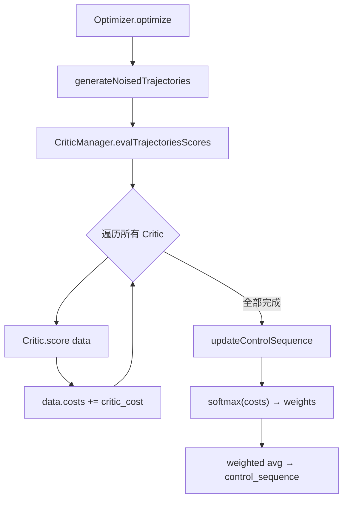
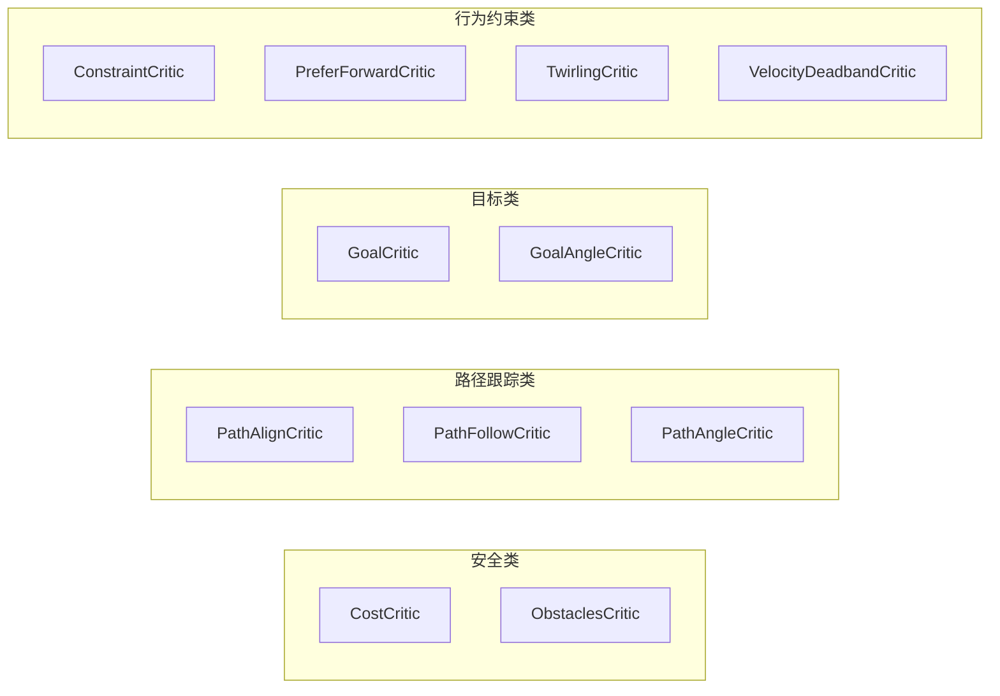

# Nav2 MPPI Controller — Critics 原理与调优指南

## 1. MPPI 算法框架中的 Critic 角色

### 1.1 MPPI 控制循环

MPPI (Model Predictive Path Integral) 是一种基于采样-评估-加权平均的最优控制方法。每个控制周期执行：

```
optimize():
  for i in range(iteration_count):        # 通常 iteration_count=1
    1. generateNoisedTrajectories()        # 从当前最优控制序列 + 高斯噪声生成 batch_size 条候选轨迹
    2. evalTrajectoriesScores(critics_data) # 所有 Critic 依次对每条轨迹打分，累加到 costs[]
    3. updateControlSequence()              # 基于 softmax 权重更新控制序列
```

**关键数据维度**：
- `batch_size`：候选轨迹数量（默认 1000~2000）
- `time_steps`：轨迹时间步数（默认 56）
- `model_dt`：时间步长（默认 0.05s）

### 1.2 Critic 的数学本质

每个 Critic 本质上是一个代价函数 $c_k(\tau)$，对候选轨迹 $\tau$ 计算一个标量代价。所有 Critic 的代价**线性累加**到 `data.costs` 数组中：

$$C(\tau_i) = \sum_{k=1}^{K} c_k(\tau_i)$$

最终通过 softmax 加权平均选择最优控制：

$$w_i = \frac{\exp(-\frac{1}{\lambda} \tilde{C}_i)}{\sum_j \exp(-\frac{1}{\lambda} \tilde{C}_j)}$$

$$u^* = \sum_i w_i \cdot u_i$$

其中 $\lambda$ 是 `temperature` 参数（默认 0.3），$\tilde{C}_i = C_i - \min(C)$ 是归一化代价。

### 1.3 Critic 基类架构

```
CriticFunction (抽象基类)
├── on_configure()     # 加载参数、初始化
├── score(data) = 0    # 纯虚函数：计算代价
├── initialize() = 0   # 纯虚函数：子类初始化
├── enabled_           # 是否启用
├── name_, parent_name_
├── costmap_ros_, costmap_
└── parameters_handler_
```

`CriticData` 结构：

| 字段 | 类型 | 说明 |
|------|------|------|
| `state` | `models::State` | 速度矩阵 vx/vy/wz [batch×timesteps] |
| `trajectories` | `models::Trajectories` | 轨迹坐标 x/y/yaws [batch×timesteps] |
| `path` | `models::Path` | 全局路径点 x/y/yaws |
| `goal` | `Pose` | 目标位姿 |
| `costs` | `ArrayXf` | **输出**：代价向量 [batch] |
| `model_dt` | `float` | 时间步长 |
| `fail_flag` | `bool` | 全部轨迹碰撞标志 |
| `furthest_reached_path_point` | `optional<size_t>` | 轨迹到达的最远路径点索引 |
| `path_pts_valid` | `optional<vector<bool>>` | 路径点有效性（是否被障碍物占据） |

### 1.4 Critic 加载机制

通过 pluginlib 动态加载。YAML 配置中 `critics` 列表指定加载顺序：

```yaml
critics: ["ConstraintCritic", "CostCritic", "GoalCritic", ...]
```

**执行顺序等于配置顺序**，每个 Critic 的 `score()` 依次调用，代价累加到 `data.costs`。

### 1.5 公共父级参数

多个 Critic 从父级（MPPI Controller）读取 `enforce_path_inversion` 参数，**该参数在 Controller 顶层配置，不在 Critic 子节点内**：

| 父级参数 | 默认值 | 读取的 Critic |
|---------|--------|--------------|
| `enforce_path_inversion` | false | GoalCritic, GoalAngleCritic, CostCritic, PathAlignCritic, PathFollowCritic, PathAngleCritic, PreferForwardCritic, TwirlingCritic |
| `vx_max` / `vx_min` / `vy_max` | 0.5 / -0.35 / 0.5 | ConstraintCritic, PathAngleCritic |

`enforce_path_inversion` 的作用：启用后，Critic 在倒车路段（路径朝向翻转时）将目标点设为路径反转点而非最终目标，避免倒车时目标计算错误。

---

## 2. 全部 Critic 原理详解

### 2.1 ConstraintCritic — 运动学约束

**源文件**：`src/critics/constraint_critic.cpp`

**目的**：惩罚超出运动学/动力学边界的速度。

**数学公式**：

- **差速驱动 (DiffDrive)**：
$$c(\tau) = w \cdot \sum_t \left[ \max(v_x(t) - v_{max}, 0) + \max(v_{min} - v_x(t), 0) \right] \cdot dt$$

> $c(\tau)$：轨迹 $\tau$ 的代价 | $w$：`cost_weight` | $v_x(t)$：轨迹第 $t$ 步的前向速度 | $v_{max}$、$v_{min}$：父级速度边界 | $dt$：`model_dt`

- **全向驱动 (Omni)**：
$$v_{total} = \text{sgn}(v_x) \cdot \sqrt{v_x^2 + v_y^2}$$
$$c(\tau) = w \cdot \sum_t \left[ \max(v_{total} - v_{max}, 0) + \max(v_{min} - v_{total}, 0) \right] \cdot dt$$

> $v_{total}$：合成速度标量 | $v_y$：横向速度（全向模型独有） | 其余同上

- **阿克曼 (Ackermann)**：
$$c(\tau) = w \cdot \sum_t \left[ \max(v_x - v_{max}, 0) + \max(v_{min} - v_x, 0) + \max(r_{min} - \frac{|v_x|}{|w_z|}, 0) \right] \cdot dt$$

> $r_{min}$：最小转弯半径 | $\frac{|v_x|}{|w_z|}$：实际转弯半径 | $w_z$：角速度

**参数及调优说明**：

| 参数 | 默认值 | 说明 | 调优建议 |
|------|--------|------|---------|
| `enabled` | true | 是否启用 | 调试时可临时关闭以隔离问题 |
| `cost_power` | 1 | 代价乘方次数 | 设为 2 可对越界行为施加二次惩罚；通常保持 1 |
| `cost_weight` | 4.0 | 越界速度的惩罚权重 | 增大使机器人更严格遵守速度限制；减小则允许更多探索 |
| `vx_max`* | 0.5 | 最大前向速度(m/s) | 父级参数，ConstraintCritic 读取用于计算边界 |
| `vx_min`* | -0.35 | 最小速度/最大倒车速度(m/s) | 父级参数；设为 0 禁止倒车 |
| `vy_max`* | 0.5 | 最大横向速度(m/s) | 父级参数；仅全向驱动模型有效 |

> \* 标记的参数为父级（Controller 顶层）参数，不在 Critic 子节点内配置。

**原理要点**：这是一个"软约束"，不是硬约束。它通过增加代价使 MPPI 倾向于选择合法速度，但不完全排除超限轨迹（硬约束由 `applyControlSequenceConstraints()` 在最终输出时施加）。`cost_power > 1` 时对越界行为施加指数级惩罚。

---

### 2.2 CostCritic — 代价地图评分

**源文件**：`src/critics/cost_critic.cpp`

**目的**：利用代价地图对轨迹上每个点的代价值进行累积评估。

**数学公式**：

对每条轨迹 $\tau_i$ 的每个采样点 $(x_j, y_j)$：

```
if 碰撞:
    traj_cost = collision_cost  (≈ 1,000,000)
elif cost >= near_collision_cost (≈253):
    traj_cost += critical_cost  (≈300)
elif not near_goal:
    traj_cost += pose_cost      (0~252)
```

最终：
$$c(\tau_i) = \frac{w}{254 \cdot N_{samples}} \cdot \text{traj\_cost}_i$$

> $c(\tau_i)$：第 $i$ 条轨迹的代价 | $w$：`cost_weight`（内部已 ÷254） | $254$：代价地图最大有效值 | $N_{samples}$：有效采样点数 | $\text{traj\_cost}_i$：该轨迹累积的原始代价

**关键设计**：
- 权重 `weight` 初始化时自动除以 254（代价地图最大值），归一化到 [0,1] 范围
- `trajectory_point_step`（默认 2）实现降采样，每隔 step 个点检查一次，减少计算量
- 靠近目标时（`near_goal_distance` 内）跳过偏好项，避免因目标附近障碍物导致过度回避

**参数及调优说明**：

| 参数 | 默认值 | 说明 | 调优建议 |
|------|--------|------|---------|
| `enabled` | true | 是否启用 | — |
| `cost_weight` | 3.81 | 代价权重（内部自动 ÷254 归一化） | 增大 → 更强烈回避高代价区域；减小 → 允许更贴近障碍物 |
| `cost_power` | 1 | 代价乘方次数 | 通常保持 1 |
| `critical_cost` | 300.0 | 当轨迹点代价 ≥ `near_collision_cost` 时的单点惩罚 | 增大 → 更强烈拒绝近碰撞轨迹 |
| `near_collision_cost` | 253 | 触发 `critical_cost` 的代价值阈值 | 253 = INSCRIBED；降低可提前触发惩罚 |
| `collision_cost` | 1,000,000 | 碰撞轨迹的整体惩罚 | 应远大于其他代价，确保碰撞轨迹被排除 |
| `near_goal_distance` | 0.5 | 目标附近距离阈值(m) | 在此距离内跳过偏好项，避免目标附近障碍物导致过度回避 |
| `consider_footprint` | false | 是否使用足印进行碰撞检查 | 非圆形机器人设为 true（计算量增大） |
| `trajectory_point_step` | 2 | 轨迹采样步长 | 增大减少计算量但降低精度；2 表示每隔一个点检查 |
| `inflation_layer_name` | "" | 指定 inflation layer 名称 | 为空则自动查找；多层 inflation 时需显式指定 |

**碰撞判定逻辑**：
- `LETHAL_OBSTACLE` (254)：始终碰撞
- `INSCRIBED_INFLATED_OBSTACLE` (253)：考虑足印时不碰撞（需进一步检查），不考虑时碰撞
- `NO_INFORMATION` (255)：若追踪未知则不碰撞，否则碰撞

---

### 2.3 ObstaclesCritic — 障碍物回避

**源文件**：`src/critics/obstacles_critic.cpp`

**目的**：基于势场方法的障碍物回避，提供碰撞硬惩罚 + 斥力场软惩罚。

**数学公式**：

对每条轨迹的每个点计算代价值和到最近障碍物距离：

$$d_{obj} = \frac{\alpha \cdot r_{inscribed} - \ln(\text{cost}) + \ln(253)}{\alpha}$$

> $d_{obj}$：轨迹点到最近障碍物的物理距离(m) | $\alpha$：inflation layer 的 cost scaling factor | $r_{inscribed}$：机器人内切圆半径 | $\text{cost}$：代价地图在该点的代价值(1~253)

代价组成：
$$c(\tau_i) = w_{crit} \cdot \text{raw\_cost}_i + w_{rep} \cdot \frac{\text{repulsive\_cost}_i - \min(\text{repulsive})}{\text{traj\_len}}$$

> $w_{crit}$：`critical_weight` | $w_{rep}$：`repulsion_weight` | $\text{raw\_cost}_i$：碰撞惩罚(margin 内累积距离或 `collision_cost`) | $\text{repulsive\_cost}_i$：斥力累积 = $\sum(\text{inflation\_radius} - d_{obj})$ | $\text{traj\_len}$：轨迹时间步数

**参数及调优说明**：

| 参数 | 默认值 | 说明 | 调优建议 |
|------|--------|------|---------|
| `enabled` | true | 是否启用 | — |
| `repulsion_weight` | 1.5 | 斥力场权重，偏好远离障碍物的轨迹 | 增大 → 更保守避障；走廊场景中需适当降低避免抖动 |
| `critical_weight` | 20.0 | 碰撞/近碰撞的权重 | 增大 → 更强烈拒绝危险轨迹 |
| `collision_cost` | 100,000 | 碰撞轨迹的整体惩罚 | 应远大于其他代价；与 CostCritic 的 1M 相比更小 |
| `collision_margin_distance` | 0.10 | 碰撞边界距离(m)，小于此距离累积惩罚 | 增大 → 更早触发近碰撞惩罚，行为更保守 |
| `near_goal_distance` | 0.5 | 目标附近距离阈值(m) | 在此距离内跳过斥力项，避免目标附近有障碍物时无法到位 |
| `consider_footprint` | false | 是否使用足印碰撞检查 | 非圆形机器人设为 true |
| `cost_power` | 1 | 代价乘方次数 | 通常保持 1 |
| `inflation_layer_name` | "" | 指定 inflation layer 名称 | 为空自动查找；多 inflation layer 时显式指定 |

**与 CostCritic 的区别**：
- **CostCritic**：直接使用代价地图代数值，简单高效
- **ObstaclesCritic**：从代价地图反推实际物理距离，实现基于势场的斥力，更"智能"但计算更重
- **二选一即可**，不应同时启用

---

### 2.4 GoalCritic — 目标位置吸引

**源文件**：`src/critics/goal_critic.cpp`

**目的**：在接近目标时，将轨迹末端拉向目标位置。

**激活条件**：机器人距离目标 < `threshold_to_consider`（默认 1.4m）

**数学公式**：

$$c(\tau_i) = w \cdot \frac{1}{T} \sum_{t=1}^{T} \sqrt{(\Delta x_t)^2 + (\Delta y_t)^2}$$

> $c(\tau_i)$：第 $i$ 条轨迹的代价 | $w$：`cost_weight` | $T$：轨迹时间步总数 | $\Delta x_t$：轨迹第 $t$ 步与目标的 x 偏差 | $\Delta y_t$：轨迹第 $t$ 步与目标的 y 偏差 | 公式含义为轨迹各点到目标的平均欧氏距离

**关键特性**：
- 取轨迹**所有时间步**的平均距离，不只看末端点
- 仅在接近目标时激活，避免在远距离时过早收敛
- 配合 `enforce_path_inversion` 参数支持倒车场景

**参数及调优说明**：

| 参数 | 默认值 | 说明 | 调优建议 |
|------|--------|------|---------|
| `enabled` | true | 是否启用 | — |
| `cost_weight` | 5.0 | 目标距离的惩罚权重 | 增大 → 到位更积极；减小 → 路径跟踪优先级相对提升 |
| `cost_power` | 1 | 代价乘方次数 | 通常保持 1 |
| `threshold_to_consider` | 1.4 | 激活距离(m)，距目标小于此值时才生效 | 应 > GoalAngleCritic 的阈值，确保先到位再对向 |
| `enforce_path_inversion`* | false | 倒车路段目标点处理 | 启用后倒车时目标设为路径反转点，而非最终目标 |

---

### 2.5 GoalAngleCritic — 目标朝向对齐

**源文件**：`src/critics/goal_angle_critic.cpp`

**目的**：在接近目标时，惩罚轨迹朝向与目标朝向的偏差。

**激活条件**：机器人距离目标 < `threshold_to_consider`（默认 0.5m）

**数学公式**：

$$c(\tau_i) = w \cdot \frac{1}{T} \sum_{t=1}^{T} |\text{shortest\_angular\_distance}(\theta_{traj}(i,t), \theta_{goal})|$$

> $w$：`cost_weight` | $T$：轨迹时间步总数 | $\theta_{traj}(i,t)$：第 $i$ 条轨迹第 $t$ 步的朝向角(rad) | $\theta_{goal}$：目标朝向角 | $\text{shortest\_angular\_distance}$：取 $[-\pi, \pi]$ 范围内的最短角度差 | 公式含义为轨迹各点到目标朝向的平均角度偏差

**参数及调优说明**：

| 参数 | 默认值 | 说明 | 调优建议 |
|------|--------|------|---------|
| `enabled` | true | 是否启用 | — |
| `cost_weight` | 3.0 | 目标朝向偏差的惩罚权重 | 增大 → 朝向对齐更积极；过大可能导致到位前过度旋转 |
| `cost_power` | 1 | 代价乘方次数 | 通常保持 1 |
| `threshold_to_consider` | 0.5 | 激活距离(m)，距目标小于此值时才生效 | 应 < GoalCritic 的阈值(1.4)，形成先到位再对向的接力 |
| `enforce_path_inversion`* | false | 倒车路段目标点处理 | 父级参数 |

**设计意图**：GoalCritic 先把机器人拉到目标位置（1.4m 激活），GoalAngleCritic 再精细调整朝向（0.5m 激活）。两者阈值之差确保先到位再对向。

---

### 2.6 PathAlignCritic — 路径对齐

**源文件**：`src/critics/path_align_critic.cpp`

**目的**：使候选轨迹沿全局路径紧密对齐，是最复杂的 Critic 之一。

**核心算法**：

1. 将全局路径和候选轨迹分别计算**弧长积分距离**
2. 对轨迹的每个采样点，通过弧长匹配找到**最近路径点**
3. 计算采样点到最近路径点的欧氏距离
4. 取平均值作为该轨迹的对齐代价

**数学公式**：

$$c(\tau_i) = w \cdot \frac{1}{N} \sum_{p=1}^{N} \sqrt{(x_{path}(p^*) - x_{traj}(i,p))^2 + (y_{path}(p^*) - y_{traj}(i,p))^2}$$

> $w$：`cost_weight` | $N$：有效采样点数 | $x_{traj}(i,p)$：第 $i$ 条轨迹第 $p$ 个采样点的 x 坐标 | $x_{path}(p^*)$：通过弧长匹配找到的对应路径点 x 坐标 | $p^*$：与轨迹点弧长距离最接近的路径点索引

**跳过条件**（不施加代价的场景）：
- 距目标 < `threshold_to_consider`（0.5m）：让 Goal Critic 接管
- `furthest_reached_path_point` < `offset_from_furthest`（20）：刚开始跟踪，路径信息不足
- 路径点被障碍物占据比例 > `max_path_occupancy_ratio`（7%）：动态障碍物挡路，不要强制对齐

**参数及调优说明**：

| 参数 | 默认值 | 说明 | 调优建议 |
|------|--------|------|---------|
| `enabled` | true | 是否启用 | — |
| `cost_weight` | 10.0 | 路径对齐惩罚权重 | 核心调优参数；增大 → 路径跟踪更紧密；过大可能导致避障能力下降 |
| `cost_power` | 1 | 代价乘方次数 | 通常保持 1 |
| `max_path_occupancy_ratio` | 0.07 | 路径被障碍物占据的最大比例 | 增大 → 即使路径部分被挡也强制对齐；减小 → 更灵活绕开障碍物 |
| `offset_from_furthest` | 20 | 要求已跟踪路径点数 ≥ 此值才激活 | 路径跟踪初期信息不足，过低会导致误判；通常保持默认 |
| `trajectory_point_step` | 4 | 轨迹采样步长 | 增大减少计算量但降低精度；4 表示每 4 个轨迹点取 1 个 |
| `threshold_to_consider` | 0.5 | 目标附近停用距离(m) | < 此距离时让 GoalCritic 接管 |
| `use_path_orientations` | false | 对齐计算中是否包含朝向偏差 | 需要精确跟随路径朝向时启用（如窄通道） |
| `enforce_path_inversion`* | false | 倒车路段目标点处理 | 父级参数 |

**`use_path_orientations` 选项**：启用后在距离计算中加入朝向偏差：
$$d = \sqrt{\Delta x^2 + \Delta y^2 + \Delta\theta^2}$$

> $d$：综合距离 | $\Delta x, \Delta y$：位置偏差 | $\Delta\theta$：朝向偏差(rad) | 启用后对齐精度更高但代价量级增大

---

### 2.7 PathFollowCritic — 路径跟踪

**源文件**：`src/critics/path_follow_critic.cpp`

**目的**：驱使轨迹末端到达路径上的前视点。

**数学公式**：

取路径上第 `furthest_reached + offset_from_furthest` 个点作为目标：

$$c(\tau_i) = w \cdot \sqrt{(x_{last} - x_{path})^2 + (y_{last} - y_{path})^2}$$

> $w$：`cost_weight` | $x_{last}$：轨迹末端点（最后一个时间步）的 x 坐标 | $x_{path}$：目标路径点的 x 坐标 | 公式含义为轨迹末端到前视路径点的欧氏距离

**关键特性**：
- 只看轨迹**末端点**（最后一个时间步）到目标路径点的距离
- 如果目标路径点被障碍物占据，自动跳到下一个有效点
- 与 PathAlignCritic 互补：PathAlign 关注全程对齐，PathFollow 关注终点到位

**参数及调优说明**：

| 参数 | 默认值 | 说明 | 调优建议 |
|------|--------|------|---------|
| `enabled` | true | 是否启用 | — |
| `cost_weight` | 5.0 | 末端到路径点距离的惩罚权重 | 增大 → 更积极驱动末端到前视点 |
| `cost_power` | 1 | 代价乘方次数 | 通常保持 1 |
| `offset_from_furthest` | 6 | 前视偏移量（路径点数） | 增大 → 看得更远，轨迹更平滑；减小 → 更紧密跟踪但可能更抖 |
| `threshold_to_consider` | 1.4 | 目标附近停用距离(m) | 与 GoalCritic 阈值一致，接近目标时让 Goal Critic 接管 |
| `enforce_path_inversion`* | false | 倒车路段目标点处理 | 父级参数 |

---

### 2.8 PathAngleCritic — 路径朝向引导

**源文件**：`src/critics/path_angle_critic.cpp`

**目的**：惩罚轨迹末端朝向与目标路径点方向的偏差。

**三种模式**：

| mode | 名称 | 行为 |
|------|------|------|
| 0 | `FORWARD_PREFERENCE` | 只惩罚前向偏差，适合差速驱动 |
| 1 | `NO_DIRECTIONAL_PREFERENCE` | 双向偏差都惩罚，适合允许倒车的场景 |
| 2 | `CONSIDER_FEASIBLE_PATH_ORIENTATIONS` | 使用路径点的实际朝向，而非到路径点的方向角 |

**数学公式**（以 mode=0 为例）：

$$\text{angle\_to\_path} = \text{atan2}(y_{path} - y_{last}, x_{path} - x_{last})$$
$$c(\tau_i) = w \cdot |\text{shortest\_angular\_distance}(\theta_{last}, \text{angle\_to\_path})|$$

> $\text{angle\_to\_path}$：从轨迹末端到目标路径点的方向角(rad) | $x_{last}, y_{last}$：轨迹末端坐标 | $x_{path}, y_{path}$：前视路径点坐标 | $w$：`cost_weight` | $\theta_{last}$：轨迹末端朝向角 | 公式含义为轨迹末端朝向与"指向路径点方向"的角度差

**前置条件**：如果当前朝向到目标路径点的角度 < `max_angle_to_furthest`（默认 45°），直接返回不施加代价（已经对齐了）。

**参数及调优说明**：

| 参数 | 默认值 | 说明 | 调优建议 |
|------|--------|------|---------|
| `enabled` | true | 是否启用 | — |
| `cost_weight` | 2.2 | 朝向偏差惩罚权重 | 增大 → 朝向对齐更积极；与 PathAlign weight 协调避免冲突 |
| `cost_power` | 1 | 代价乘方次数 | 通常保持 1 |
| `offset_from_furthest` | 4 | 目标路径点的前视偏移 | 增大 → 朝向对齐的目标点更远，转弯更平滑 |
| `threshold_to_consider` | 0.5 | 目标附近停用距离(m) | 接近目标时停止朝向引导，让 GoalAngleCritic 接管 |
| `max_angle_to_furthest` | 0.785 (≈45°) | 角度跳过阈值(rad) | 当前朝向偏差 < 此值时不施加代价（已对齐）；增大使 Critic 更"懒" |
| `mode` | 0 | 朝向模式：0=前向偏好，1=双向，2=路径朝向 | 差速驱动用 0；允许倒车用 1；需精确跟随路径朝向用 2 |
| `enforce_path_inversion`* | false | 倒车路段目标点处理 | 父级参数 |
| `vx_min`* | -0.35 | 最小速度 | 父级参数；用于判断是否允许倒车(mode 自动降级) |

---

### 2.9 PreferForwardCritic — 前进偏好

**源文件**：`src/critics/prefer_forward_critic.cpp`

**目的**：惩罚倒车运动。

**数学公式**：

$$c(\tau_i) = w \cdot \sum_t \max(-v_x(t), 0) \cdot dt$$

> $w$：`cost_weight` | $v_x(t)$：轨迹第 $t$ 步的前向速度 | $dt$：`model_dt` | $\max(-v_x, 0)$：当 $v_x < 0$（倒车）时为 $|v_x|$，前进时为 0 | 公式含义为倒车速度的时间积分

只对负向速度（倒车）施加代价，前进时代价为 0。

**参数及调优说明**：

| 参数 | 默认值 | 说明 | 调优建议 |
|------|--------|------|---------|
| `enabled` | true | 是否启用 | 不需要倒车的差速驱动机器人建议启用 |
| `cost_weight` | 5.0 | 倒车惩罚权重 | 增大 → 更强烈避免倒车；设为 0 等效禁用 |
| `cost_power` | 1 | 代价乘方次数 | 通常保持 1 |
| `threshold_to_consider` | 0.5 | 目标附近停用距离(m) | 接近目标时允许倒车以精确到位 |
| `enforce_path_inversion`* | false | 倒车路段目标点处理 | 父级参数 |

**使用场景**：差速驱动机器人无倒车需求时启用。全向驱动机器人通常不需要。

---

### 2.10 TwirlingCritic — 防止原地旋转

**源文件**：`src/critics/twirling_critic.cpp`

**目的**：防止全向驱动机器人在行进中不必要的原地旋转。

**数学公式**：

$$c(\tau_i) = w \cdot \frac{1}{T} \sum_t |w_z(t)|$$

> $w$：`cost_weight` | $T$：轨迹时间步总数 | $w_z(t)$：轨迹第 $t$ 步的角速度(rad/s) | 公式含义为轨迹角速度绝对值的平均，惩罚高旋转轨迹

**参数及调优说明**：

| 参数 | 默认值 | 说明 | 调优建议 |
|------|--------|------|---------|
| `enabled` | true | 是否启用 | 仅全向驱动机器人需要 |
| `cost_weight` | 10.0 | 旋转惩罚权重 | 增大 → 更强烈抑制不必要的旋转；过大会影响正常转弯 |
| `cost_power` | 1 | 代价乘方次数 | 通常保持 1 |
| `enforce_path_inversion`* | false | 倒车路段目标点处理 | 父级参数 |

**使用场景**：全向驱动（Omni）机器人专用。差速驱动不需要（因为差速旋转是正常行为）。

---

### 2.11 VelocityDeadbandCritic — 速度死区惩罚

**源文件**：`src/critics/velocity_deadband_critic.cpp`

**目的**：惩罚落在死区范围内的速度指令（避免电机抖动）。

**数学公式**：

$$c(\tau_i) = w \cdot \sum_t \left[ \max(|db_{vx}| - |v_x|, 0) + \max(|db_{vy}| - |v_y|, 0) + \max(|db_{wz}| - |w_z|, 0) \right] \cdot dt$$

> $w$：`cost_weight` | $db_{vx}, db_{vy}, db_{wz}$：`deadband_velocities` 三个分量 | $v_x, v_y, w_z$：轨迹各步的速度 | 当速度低于死区阈值时 $\max(|db| - |v|, 0) > 0$ 产生代价 | 公式含义为速度落入死区程度的累积

当速度低于死区阈值时施加惩罚，驱动 MPPI 选择更明确的运动指令。

**参数及调优说明**：

| 参数 | 默认值 | 说明 | 调优建议 |
|------|--------|------|---------|
| `enabled` | true | 是否启用 | 仅在电机存在死区时启用 |
| `cost_weight` | 35.0 | 死区惩罚权重（默认较高） | 增大 → 更强烈避免死区内的微小速度指令 |
| `cost_power` | 1 | 代价乘方次数 | 通常保持 1 |
| `deadband_velocities` | [0, 0, 0] | 死区阈值 [vx, vy, wz] | 设为电机实际死区值（如 [0.05, 0.05, 0.05]）；单位 m/s 或 rad/s |

---

## 3. Critic 协作机制

### 3.1 代价累加流程



### 3.2 Critic 分类与推荐组合



**推荐组合**：

| 机器人类型 | 推荐 Critic 列表 |
|-----------|-----------------|
| 差速驱动 | ConstraintCritic, CostCritic, GoalCritic, GoalAngleCritic, PathAlignCritic, PathFollowCritic, PathAngleCritic, PreferForwardCritic |
| 全向驱动 | ConstraintCritic, CostCritic, GoalCritic, GoalAngleCritic, PathAlignCritic, PathFollowCritic, PathAngleCritic, TwirlingCritic |
| 阿克曼 | ConstraintCritic, CostCritic, GoalCritic, GoalAngleCritic, PathAlignCritic, PathFollowCritic, PathAngleCritic |

### 3.3 threshold_to_consider 的层级切换

Critic 通过 `threshold_to_consider` 参数实现**距离相关的行为切换**：

| 距目标距离 | 激活的 Critic | 行为 |
|-----------|-------------|------|
| > 1.4m | PathAlign, PathFollow, PathAngle, PreferForward, Constraint | 路径跟踪为主 |
| 0.5~1.4m | + GoalCritic, + PathFollow | 路径跟踪 + 目标吸引 |
| < 0.5m | GoalCritic, GoalAngleCritic | 精确到位 + 朝向对齐 |

---

## 4. 调优策略

### 4.1 调优优先级

**第一步**：确保基础参数正确（`motion_model`, `vx_max/min`, `wz_max`, `model_dt`）

**第二步**：安全类 Critic 调优（最重要）
- 选择 `CostCritic` 或 `ObstaclesCritic` 之一
- 调整 `collision_cost` 确保碰撞轨迹被完全排除
- 调整 `repulsion_weight`/`cost_weight` 控制避障激进度

**第三步**：路径跟踪类调优
- `PathAlignCritic.weight` 是路径跟踪的核心权重
- `PathFollowCritic.offset_from_furthest` 控制前视距离
- `PathAngleCritic.mode` 根据是否需要倒车选择

**第四步**：目标到达调优
- `GoalCritic.threshold_to_consider` 应 > `GoalAngleCritic.threshold_to_consider`
- 调整两者的 weight 比例以平衡到位精度和朝向精度

### 4.2 常见问题与解决方案

| 问题 | 可能原因 | 调整方向 |
|------|---------|---------|
| 路径跟踪不紧密 | PathAlign weight 过低 | 增大 PathAlign.cost_weight |
| 走 S 形弯路 | PathAlign + PathAngle 冲突 | 减小 PathAngle weight 或增大 offset |
| 接近目标时抖动 | Goal/GoalAngle 阈值设置不当 | 增大 threshold_to_consider 差值 |
| 障碍物旁犹豫 | CostCritic/ObstaclesCritic weight 过高 | 降低 weight 或增大 inflation_radius |
| 频繁碰撞 | 避障 weight 不足或 inflation_radius 过小 | 增大 critical_weight / collision_cost |
| 倒车行为（不期望） | PreferForward 未启用或 weight 过低 | 启用并增大 cost_weight |
| 全向机器人原地旋转 | TwirlingCritic 未启用 | 启用 TwirlingCritic |
| 轨迹末端不精确 | batch_size 不足 | 增大 batch_size 或增大 Goal weights |
| 计算负载过高 | Critic 过多或采样步长过密 | 减少 Critic 数量，增大 trajectory_point_step |

### 4.3 cost_power 的作用

`cost_power` 控制代价的非线性程度：

- `cost_power = 1`：线性代价（默认，推荐）
- `cost_power = 2`：二次代价，对偏差大的轨迹施加指数级惩罚

**使用建议**：绝大多数场景保持 `cost_power = 1`。仅在特定 Critic（如 ConstraintCritic）需要对越界行为施加额外惩罚时提高。

### 4.4 全局参数对 Critic 效果的影响

| 全局参数 | 影响的 Critic | 说明 |
|---------|-------------|------|
| `temperature` | 全部 | 越低越贪婪（只选最低代价轨迹），越高越均匀 |
| `gamma` | updateControlSequence | 控制正则化项，越大越倾向保持当前控制 |
| `batch_size` | 全部 | 更多轨迹 = 更好的优化质量 |
| `vx_std/wz_std` | 全部 | 噪声标准差，影响轨迹多样性和探索范围 |
| `iteration_count` | 全部 | 多次迭代可改善控制质量但增加延迟 |

### 4.5 调试工具

启用 `publish_critics_stats: true` 后，CriticManager 会发布 `~/critics_stats` 话题，包含每个 Critic 对每条轨迹的代价贡献。可用于：
- 确认各 Critic 的实际贡献量级
- 发现权重失衡问题
- 监控特定 Critic 是否过度/不足影响行为

---

## 5. 参考配置模板

```yaml
FollowPath:
  plugin: "nav2_mppi_controller::MPPIController"
  model_dt: 0.05
  time_steps: 56
  batch_size: 2000
  vx_std: 0.2
  vy_std: 0.2
  wz_std: 0.4
  vx_max: 0.5
  vx_min: -0.35
  vy_max: 0.5
  wz_max: 1.9
  iteration_count: 1
  temperature: 0.3
  gamma: 0.015
  motion_model: "DiffDrive"
  publish_critics_stats: true

  critics: [
    "ConstraintCritic", "CostCritic", "GoalCritic",
    "GoalAngleCritic", "PathAlignCritic",
    "PathFollowCritic", "PathAngleCritic",
    "PreferForwardCritic"
  ]

  ConstraintCritic:
    enabled: true
    cost_power: 1
    cost_weight: 4.0

  CostCritic:
    enabled: true
    cost_power: 1
    cost_weight: 3.81
    critical_cost: 300.0
    near_collision_cost: 253
    collision_cost: 1000000.0
    near_goal_distance: 0.5
    consider_footprint: false
    trajectory_point_step: 2
    inflation_layer_name: ""

  GoalCritic:
    enabled: true
    cost_power: 1
    cost_weight: 5.0
    threshold_to_consider: 1.4

  GoalAngleCritic:
    enabled: true
    cost_power: 1
    cost_weight: 3.0
    threshold_to_consider: 0.5

  PathAlignCritic:
    enabled: true
    cost_power: 1
    cost_weight: 14.0
    max_path_occupancy_ratio: 0.05
    trajectory_point_step: 4
    threshold_to_consider: 0.5
    offset_from_furthest: 20
    use_path_orientations: false

  PathFollowCritic:
    enabled: true
    cost_power: 1
    cost_weight: 5.0
    offset_from_furthest: 5
    threshold_to_consider: 1.4

  PathAngleCritic:
    enabled: true
    cost_power: 1
    cost_weight: 2.0
    offset_from_furthest: 4
    threshold_to_consider: 0.5
    max_angle_to_furthest: 1.0
    mode: 0

  PreferForwardCritic:
    enabled: true
    cost_power: 1
    cost_weight: 5.0
    threshold_to_consider: 0.5

  # 全向驱动机器人启用（差速驱动不需要）
  # TwirlingCritic:
  #   enabled: true
  #   cost_power: 1
  #   cost_weight: 10.0

  # 存在电机死区时启用
  # VelocityDeadbandCritic:
  #   enabled: true
  #   cost_power: 1
  #   cost_weight: 35.0
  #   deadband_velocities: [0.05, 0.05, 0.05]
```

---

## 6. 源码阅读路径

1. `critic_function.hpp` — 理解基类接口
2. `critic_data.hpp` — 理解数据流
3. `critic_manager.cpp` — 理解加载与执行流程
4. `optimizer.cpp` — 理解 MPPI 主循环和 softmax 更新
5. `cost_critic.cpp` — 理解最基础的安全 Critic
6. `path_align_critic.cpp` — 理解最复杂的路径跟踪 Critic
7. `obstacles_critic.cpp` — 理解势场避障实现

---

## 7. 参考资源

- [Nav2 MPPI Controller 官方文档](https://docs.nav2.org/configuration/packages/configuring-mppic.html)
- [Nav2 调优指南](https://docs.nav2.org/tuning/index.html)
- [MPPI 原始论文: Williams et al., "Information Theoretic MPC for Model-Based Reinforcement Learning", 2017](https://arxiv.org/abs/1709.06972)
- 源码仓库: `nav2_mppi_controller/` 目录
