# Navigation2 (Nav2) 专家级学习指南

> 生成时间：2026-03-26
> 项目仓库：https://github.com/ros-navigation/navigation2
> 目标读者：专家（Expert）
> 信息来源：Web 搜索（社区最佳实践）+ DeepWiki（官方架构分析）
> 前置要求：熟悉 ROS 2 基础通信（Topic/Service/Action）、TF2 坐标变换、机器人运动学

---

## 目录

- [1. 架构演进与设计哲学](#1-架构演进与设计哲学)
- [2. 架构深层解析](#2-架构深层解析)
- [3. 核心模块源码级解析](#3-核心模块源码级解析)
- [4. 插件开发体系](#4-插件开发体系)
- [5. 高级配置与调优](#5-高级配置与调优)
- [6. 扩展与集成](#6-扩展与集成)
- [7. 调试与诊断](#7-调试与诊断)
- [8. 性能优化](#8-性能优化)
- [9. 源码阅读目标问题清单](#9-源码阅读目标问题清单)
- [10. 参考资源](#10-参考资源)

---

## 1. 架构演进与设计哲学

### 1.1 从 `move_base` 到 Nav2 的设计动机

ROS 1 的 `move_base` 是一个**单体进程**：规划器、控制器、恢复行为全部内聚在单一节点内，通过硬编码状态机（WAIT → PLAN → CONTROLLING → ...）驱动。这种设计在小规模场景下工作良好，但在生产环境中暴露了根本性缺陷：

| 问题维度 | `move_base` (ROS 1) | Nav2 (ROS 2) |
|---|---|---|
| **模块化** | 单一进程，算法强耦合 | 服务器集群，每服务器单一职责 |
| **扩展性** | 替换算法需修改核心 | 插件热插拔，无需修改核心 |
| **启动可靠性** | 启动顺序依赖 launch 文件 | Lifecycle Manager 强制状态转换 |
| **故障隔离** | 单点崩溃全挂 | Bond 机制隔离故障节点 |
| **导航逻辑** | 硬编码状态机 | 行为树（XML，可视化） |
| **通信模式** | Topic 同步 | ROS 2 Action（异步，支持取消/反馈） |

Nav2 的设计哲学：**关注点分离 + 插件化 + 生命周期管理 + 异步通信**。每个功能单元（规划器、控制器、恢复行为）独立为服务器，通过行为树统一编排生命周期，通过 ROS 2 Action 异步调用。

### 1.2 架构设计权衡

| 权衡点 | Nav2 的选择 | 代价 | 受益场景 |
|---|---|---|---|
| **模块化 vs. 延迟** | 多进程/多节点通信 | IPC 开销高于单体内聚调用 | 需要独立更新/替换算法的生产系统 |
| **行为树 vs. 状态机** | XML 定义导航逻辑 | 学习成本 + XML 文件管理 | 需要复杂恢复序列、多条件分支的场景 |
| **Lifecycle vs. 便捷启动** | 显式状态转换 | 比 `roslaunch` 直接启动繁琐 | 需要确定性启动顺序的生产部署 |
| **插件化 vs. 默认体验** | 多算法插件可选 | 初学者选择困难 | 需要定制化算法的机器人项目 |

### 1.3 与其他导航框架对比

| 框架 | 核心差异 | 优势 | 劣势 |
|---|---|---|---|
| **Nav2** | ROS 2 官方，插件化 + 行为树 | 生态丰富，文档完善，ROS 2 原生 | 学习曲线陡峭，参数众多 |
| **Navigation1 (move_base)** | 单体状态机 | 简单，适合 ROS 1 项目 | 无法热替换，不支持 ROS 2 |
| **teb_local_planner** | 时空最短路径优化 | 考虑时间维度，适合动态障碍 | 主要为局部规划，需配合 move_base/Nav2 |
| **Open Navigation (OpenNav)** | Nav2 扩展项目 | Docking Server、Route Server、Graceful Controller | 依赖 Nav2 生态 |

---

## 2. 架构深层解析

### 2.1 系统架构总览

```mermaid
flowchart TB
    subgraph "用户接口层"
        RViz["nav2_rviz_plugins\n(NavigateToPose GUI)"]
        API["nav2_simple_commander\n(BasicNavigator Python API)"]
    end

    subgraph "导航编排层 (BT Navigator)"
        N2P["NavigateToPoseNavigator\n(plugin: nav2_core::BehaviorTreeNavigator)"]
        BTEngine["BehaviorTreeEngine\n(BehaviorTree.CPP v4)"]
        BTXML["nav2_tree_nodes.xml\n+ navigate_to_pose_w_replanning_and_recovery.xml"]
    end

    subgraph "行为树节点插件"
        CPA["ComputePathToPose\n(Action Client → PlannerServer)"]
        FPA["FollowPath\n(Action Client → ControllerServer)"]
        REC["Recovery Actions\n(Spin/BackUp/ClearCostmap/Wait)"]
        CON["Condition Nodes\n(IsPathValid/GoalReached/InitialPoseReceived)"]
        DEC["Decorator Nodes\n(RateFallback/DistanceController/GoalUpdatable)"]
    end

    subgraph "服务器层"
        PS["nav2_planner\nPlannerServer"]
        SS["nav2_smoother\nSmootherServer"]
        CS["nav2_controller\nControllerServer"]
        BHS["nav2_behaviors\nBehaviorServer"]
        CM["nav2_collision_monitor\nCollisionMonitor"]
        MS["nav2_map_server\nMapServer"]
        AMCL["nav2_amcl\nAmclNode"]
    end

    subgraph "插件层 (pluginlib 热插拔)"
        NavFn["nav2_navfn_planner\n(NavFnROS)"]
        Smac["nav2_smac_planner\n(SmacPlannerHybrid/2D/Lattice)"]
        Theta["ThetaStarPlanner"]
        RPP["nav2_regulated_pure_pursuit_controller\n(RegulatedPurePursuit)"]
        MPPI["nav2_mppi_controller\n(MPPIController)"]
        DWB["nav2_dwb_controller\n(DWBLocalPlanner)"]
    end

    subgraph "环境表示层"
        LCM["LayeredCostmap\n(全局/局部)"]
        SL["StaticLayer\n(nav_msgs/OccupancyGrid)"]
        OL["ObstacleLayer\n(LaserScan/PointCloud2)"]
        VL["VoxelLayer\n(3D raycasting → 2D projection)"]
        IL["InflationLayer\n(exponential decay)"]
    end

    subgraph "生命周期与通信"
        LM["nav2_lifecycle_manager\nLifecycleManager"]
        Bond["Bond Mechanism\n(heartbeat watchdog)"]
        TF2["TF2\n(map→odom→base_link→sensor)"]
        IPC["Intra-Process\n(Composition模式)"]
    end

    RViz -->|"NavigateToPose Action"| N2P
    API -->|"NavigateToPose Action"| N2P
    N2P --> BTEngine
    BTEngine --> BTXML
    BTEngine --> CPA
    BTEngine --> FPA
    BTEngine --> REC
    BTEngine --> CON
    BTEngine --> DEC

    CPA --> PS
    FPA --> CS
    REC --> BHS

    PS --> NavFn
    PS --> Smac
    PS -->|"plugin_lib_names"| Theta
    CS --> RPP
    CS --> MPPI
    CS --> DWB

    SS -.->|"可选平滑"| PS
    CM -.->|"cmd_vel 拦截"| CS
    MS --> LCM
    AMCL --> LCM
    AMCL -->|"map→odom"| TF2

    LCM --> SL
    LCM --> OL
    LCM --> VL
    LCM --> IL

    LM -->|"lifecycle manage"| PS
    LM -->|"lifecycle manage"| CS
    LM -->|"lifecycle manage"| SS
    LM -->|"lifecycle manage"| BHS
    LM -->|"lifecycle manage"| N2P
    LM -->|"lifecycle manage"| CM
    LM -.->|"bond heartbeat"| Bond
```

### 2.2 Lifecycle Manager 内部机制

Lifecycle Manager 是 Nav2 可靠性的核心保障。它通过 ROS 2 Lifecycle 状态机 + Bond 心跳机制管理所有从属节点的启动和关闭。

#### 2.2.1 状态转换流程

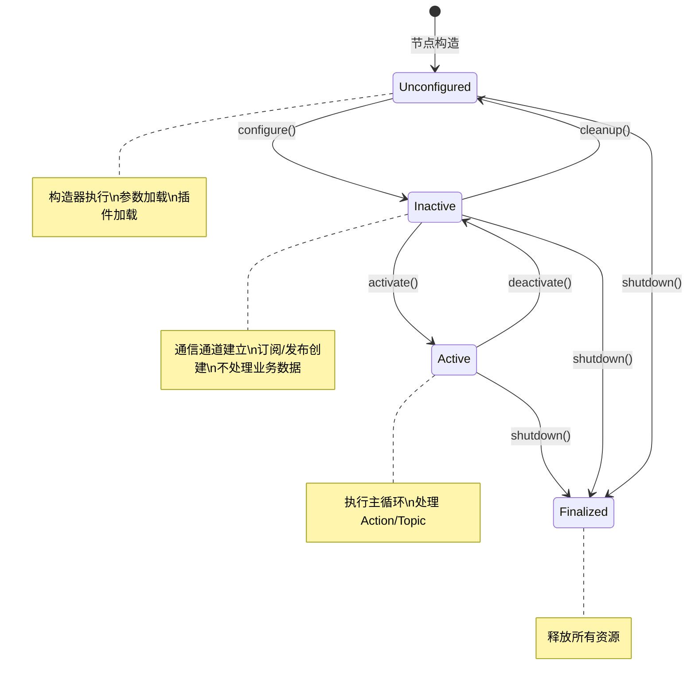

Lifecycle Manager 的 `startup()` 按**拓扑顺序**激活节点：
1. `map_server` → `amcl` → `planner_server` → `controller_server` → `bt_navigator`
2. 每个节点必须先 configure 再 activate
3. 任何节点 activate 失败（依赖未就绪）→ 整个链式失败

`shutdown()` 按**逆序**关闭：先关 BT Navigator，再关 Controller/Planner，最后关地图和定位。逆序关闭确保上层（编排者）先停止，下层（执行器）后停止。

#### 2.2.2 Bond 机制（故障隔离）

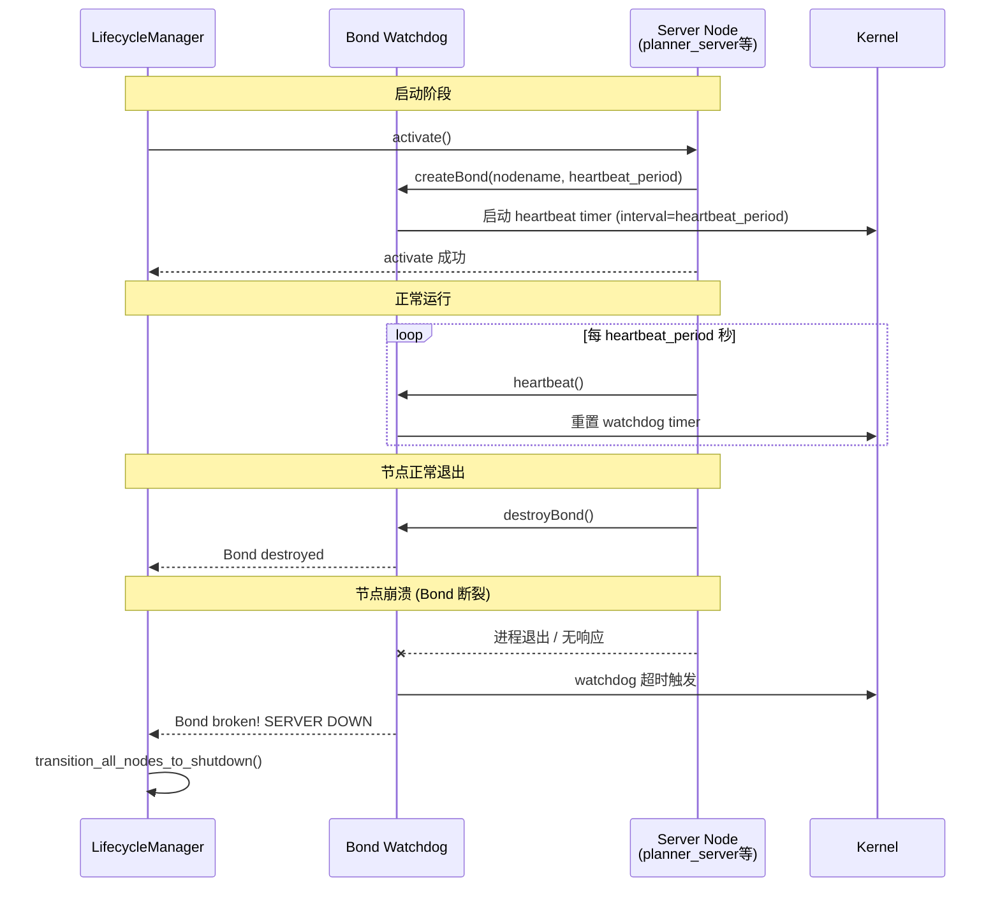

**关键参数**（`nav2_lifecycle_manager` 参数文件）：

| 参数 | 默认值 | 说明 | 调优建议 |
|---|---|---|---|
| `bond_timeout` | 4.0 s | Bond 断裂判定超时 | 生产环境可设长一些，仿真可短 |
| `bond_heartbeat_period` | 0.25 s | 心跳间隔 | 高 CPU 使用时可增大到 1.0s；过小增加开销 |
| `autostart` | false | 是否自动完成全部 lifecycle 转换 | 生产环境建议 false，手动控制更安全 |
| `attempt_respawn` | false | Bond 断裂后是否尝试重启节点 | 配合 `respawn_max_duration` 使用 |
| `node_names` | [] | 被管理的节点列表 | 必须包含完整所有 Nav2 服务器 |

**Bond 断裂时的行为**：
1. Lifecycle Manager 在日志输出 `SERVER [node_name] IS DOWN`
2. 触发所有从属节点的 `shutdown()` 链
3. 防止失控底盘（控制节点崩溃后机器人仍接收旧 cmd_vel）
4. 可选 respawn + 重新 lifecycle 转换

**常见 Bond 相关错误**：
- `Could not transition from unconfigured state`：节点 configure() 失败（参数文件路径错误、依赖缺失）
- `Bond broken`：节点心跳超时，常因节点负载过高无暇发送心跳
- Bond 创建但监控不到：IPC（进程内组合）模式下 Bond topic 路径问题

### 2.3 行为树引擎与 Tick 循环

Nav2 使用 **BehaviorTree.CPP v4** 作为行为树引擎。BtNavigator 加载 XML 格式的行为树定义文件，按策略循环执行。

#### 2.3.1 Tick 执行循环

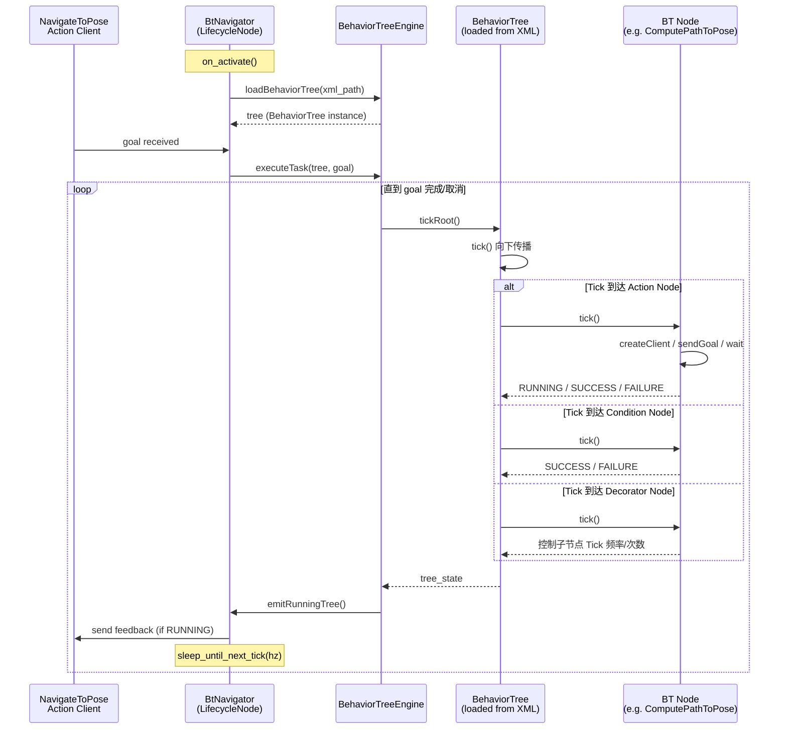

**BtNavigator 关键源码路径**：
- 核心循环：`nav2_bt_navigator/src/bt_navigator.cpp` — `BtNavigator::onExecute()` 或 `NavigatorBase::execute()`
- 行为树引擎：`nav2_behavior_tree/src/behavior_tree_engine.cpp` — `BehaviorTreeEngine::run()`
- 节点注册：`nav2_behavior_tree/plugins/` — `action/`, `condition/`, `decorator/` 各子目录

#### 2.3.2 BT 节点类型速查

| 节点类型 | 类命名空间 | 作用 | 执行模型 |
|---|---|---|---|
| `Sequence` (Control) | BT:: | 依次执行子节点，任一失败返回 FAILURE | tick once |
| `Fallback` (Control) | BT:: | 尝试子节点，第一个成功返回 SUCCESS | tick once |
| `ReactiveFallback` | BT:: | 每次 Tick 重新评估所有子节点 | tick every |
| `ReactiveSequence` | BT:: | 每次 Tick 重新执行所有子节点 | tick every |
| `RateController` (Decorator) | nav2_behavior_tree | 控制子节点 Tick 频率 | delay |
| `DistanceController` | nav2_behavior_tree | 每移动 X 米触发一次子节点 | trigger |
| `GoalUpdatable` (Decorator) | nav2_behavior_tree | 允许 Goal 改变时重启子树 | update |
| `ComputePathToPose` (Action) | nav2_bt_navigator | 调用 PlannerServer Action | async |
| `FollowPath` (Action) | nav2_bt_navigator | 调用 ControllerServer Action | async |
| `Spin` / `BackUp` / `Wait` / `DriveOnHeading` | nav2_behaviors | 调用 BehaviorServer Action | async |
| `IsPathValid` / `GoalReached` / `InitialPoseReceived` (Condition) | nav2_behavior_tree | 条件判断 | sync |

#### 2.3.3 Groot 可视化集成

BtNavigator 支持 Groot v2.x 实时可视化：

```yaml
# nav2_params.yaml 中的 bt_navigator 配置
bt_navigator:
  ros__parameters:
    enable_groot_monitoring: true
    groot_zmq_publisher_port: 1666  # Groot 订阅端口
    groot_zmq_server_port: 1667    # Groot 命令端口
```

使用流程：
1. 启动 Nav2 后，在 Groot 中连接到 `localhost:1667`
2. Groot 实时显示当前行为树执行状态（节点颜色：绿=SUCCESS，红=FAILURE，黄=RUNNING）
3. 可在 Groot 中手动触发节点，观察 Nav2 行为变化

### 2.4 Costmap Layer 叠加机制

#### 2.4.1 LayeredCostmap 架构

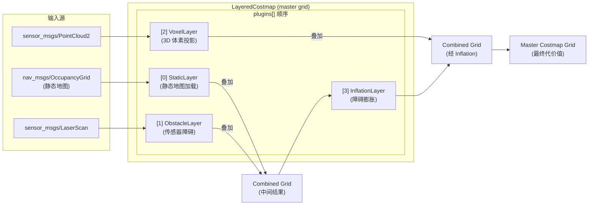

**叠加顺序至关重要**：`plugins` 数组中的顺序决定叠加顺序。典型配置：

```yaml
# 全局 costmap：静态地图 + 膨胀
plugins: ["static_layer", "inflation_layer"]

# 局部 costmap：动态障碍 + 膨胀
plugins: ["obstacle_layer", "inflation_layer"]

# 局部 costmap（3D 传感器）：
plugins: ["voxel_layer", "inflation_layer"]
```

#### 2.4.2 各层机制详解

**StaticLayer**：
- 启动时加载 `nav_msgs/OccupancyGrid`，将栅格值映射为 costmap 代价值
- 仅在 `updateBounds()` 时返回全图范围，无运行时更新
- 适合作为全局 costmap 的背景层

**ObstacleLayer**：
- 订阅 `sensor_msgs/LaserScan` 或 `PointCloud2`
- **mark**（标记障碍）：将观测到的障碍点写入栅格
- **clear**（清除障碍）：通过 raycasting 从机器人位置到障碍点的连线，清除路径上的自由空间栅格
- `combination_method`: `0`=overwrite（直接写入）, `1`=maximum（取 max）

**VoxelLayer**：
- 3D 体素网格（`z_voxels` 参数控制高度分辨率）
- 通过 3D raycasting 维护体素占用状态
- `publish_voxel_map: true` 可发布可视化体素栅格
- 将 3D 体素"压平"投影到 2D 网格，支持悬空障碍感知

**InflationLayer**：
- **指数衰减函数**：`cost = exp(-1.0 * (distance - inscribed_radius) * cost_scaling_factor) * (lethal_cost - 1)`
- `inflation_radius`：最大膨胀距离（米）
- `cost_scaling_factor`：衰减速率（越大 → 代价衰减越快 → 紧贴障碍的运动空间越大）
- `inscribed_radius`：机器人内切圆半径（膨胀不能穿透此半径的区域）

**Layer 接口核心方法**：
```cpp
// nav2_costmap_2d/include/nav2_costmap_2d/layer.hpp
class Layer {
  virtual void onInitialize() = 0;        // 插件初始化
  virtual void updateBounds(...) = 0;       // 确定需更新的区域边界
  virtual void updateCosts(...) = 0;       // 向 master grid 写入代价
  virtual void reset() = 0;                // 重置本层状态
};
```

---

## 3. 核心模块源码级解析

### 3.1 nav2_core 核心接口体系

`nav2_core` 是 Nav2 所有插件接口的定义仓库。理解这些接口是开发自定义插件的前提。

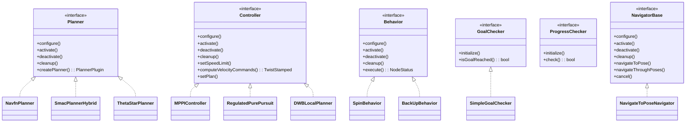

**关键接口签名**：

```cpp
// nav2_core/include/nav2_core/controller.hpp
class Controller {
  virtual void configure(
    const rclcpp_lifecycle::LifecycleNodeInterfacePtr& parent_node,
    const std::string& plugin_name,
    const std::shared_ptr<tf2_ros::Buffer>& tf,
    const std::shared_ptr<nav2_costmap_2d::Costmap2DROS>& costmap_ros) = 0;

  virtual geometry_msgs::msg::TwistStamped computeVelocityCommands(
    const geometry_msgs::msg::PoseStamped& pose,           // 当前位姿
    const geometry_msgs::msg::Twist& velocity,             // 当前速度
    nav2_core::GoalChecker*) = 0;                          // 目标检查器

  virtual void setPlan(const nav_msgs::msg::Path& path) = 0; // 设置跟踪路径
  virtual void setSpeedLimit(...) = 0;                      // 动态限速
};

// nav2_core/include/nav2_core/planner.hpp
class Planner {
  virtual geometry_msgs::msg::PoseStamped createPlan(
    const geometry_msgs::msg::PoseStamped& start,    // 起始位姿
    const geometry_msgs::msg::PoseStamped& goal,     // 目标位姿
    const nav2_costmap_2d::Costmap2D& costmap) = 0;  // 代价地图引用
};
```

### 3.2 PlannerServer 执行流程

```
nav2_planner/src/planner_server.cpp

1. on_configure() {
     plugin_map_.load(...)        // pluginlib 加载所有规划器插件
     action_server_ = rclcpp_action::create_server<ComputePathToPose>(...)
   }

2. execute() — Action Server 的目标处理循环
   └── while rclcpp::ok():
         goal_handle = action_server_->wait_for_next_goal()
         // 在 BehaviorTree.CPP 的 Action Node 驱动下被调用
         result = computePlan(goal)
         action_server_->succeeded_current(result)

3. computePlan() {
     planner = plugin_map_[request.plugin_name]
     path = planner->createPlan(start, goal, *costmap_)
   }
```

### 3.3 ControllerServer 执行流程

```
nav2_controller/src/controller_server.cpp

1. on_configure() {
     plugin_map_.load(...)        // 加载控制器插件
     action_server_ = rclcpp_action::create_server<FollowPath>(...)
     progress_checker_ = std::make_unique<SimpleProgressChecker>()
     goal_checker_ = std::make_unique<SimpleGoalChecker>()
   }

2. 主控制循环 (在 Action Server 的 asyncExecuteThread 中):
   └── loop at controller_frequency (通常 20Hz):
         auto cmd = controller_->computeVelocityCommands(
                      current_pose,     // 从 TF 查询 base_link 在 map 中位姿
                      current_velocity, // 从 /odom 话题获取
                      goal_checker_.get())
         cmd_vel_pub_->publish(cmd.twist)
         progress_checker_->check(path_)  // 检查是否卡住

3. setPlan() — 在 Action Server 接收新目标时调用
   └── path_ = action.goal.path
       controller_->setPlan(path_)
```

### 3.4 Collision Monitor 机制

Collision Monitor 是 Nav2 的**最后一道安全防线**，独立于 Nav2 行为树运行，直接监听传感器数据并在检测到近障碍时覆盖或修改 ControllerServer 的输出。

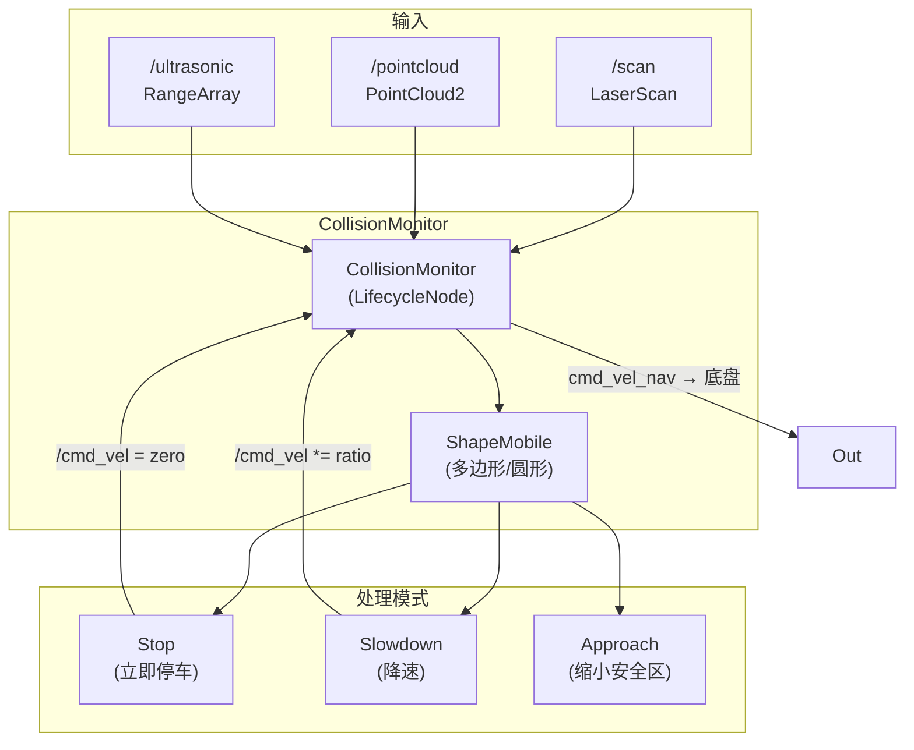

**与 Costmap 的区别**：
- Costmap 是**规划层**输入，融合历史观测，膨胀障碍，频率较低（~5-10Hz）
- Collision Monitor 是**实时安全层**，直接感知原始传感器，频率高（~20-30Hz），用于防止近处突发障碍

---

## 4. 插件开发体系

### 4.1 四类插件全解析

| 插件类型 | 基类接口 | 典型实现 | 源码位置 | 注册宏 |
|---|---|---|---|---|
| **全局规划器** | `nav2_core::Planner` | NavFn, SmacPlanner2D/Hybrid/Lattice, ThetaStar | `nav2_planner/` | `PLUGINLIB_EXPORT_CLASS` |
| **本地控制器** | `nav2_core::Controller` | MPPI, RegulatedPurePursuit, DWB | `nav2_controller/` | `PLUGINLIB_EXPORT_CLASS` |
| **BT 节点** | `BtActionNode` / `BtConditionNode` / `BtDecoratorNode` | Spin, BackUp, IsPathValid, RateController | `nav2_behavior_tree/plugins/` | `PLUGINLIB_EXPORT_CLASS` |
| **Costmap Layer** | `nav2_costmap_2d::Layer` | Static, Obstacle, Voxel, Inflation | `nav2_costmap_2d/` | `PLUGINLIB_EXPORT_CLASS` |

### 4.2 自定义控制器插件示例

```cpp
// my_controller/my_controller.cpp

#include "rclcpp/rclcpp.hpp"
#include "nav2_core/controller.hpp"
#include "nav2_util/lifecycle_node.hpp"
#include "geometry_msgs/msg/twist_stamped.hpp"
#include "pluginlib/class_list_macros.hpp"

namespace my_controller
{

class MyController : public nav2_core::Controller
{
public:
  void configure(
    const rclcpp_lifecycle::LifecycleNodeInterfacePtr& parent_node,
    const std::string& plugin_name,
    const std::shared_ptr<tf2_ros::Buffer>& tf,
    const std::shared_ptr<nav2_costmap_2d::Costmap2DROS>& costmap_ros) override
  {
    node_ = parent_node->getNodeBaseInterface();

    node_->declare_parameter(plugin_name + ".max_vel_x", rclcpp::ParameterValue(0.5));
    node_->get_parameter(plugin_name + ".max_vel_x", max_vel_x_);

    tf_ = tf;
    costmap_ros_ = costmap_ros;
    RCLCPP_INFO(node_->get_logger(), "MyController configured");
  }

  geometry_msgs::msg::TwistStamped computeVelocityCommands(
    const geometry_msgs::msg::PoseStamped& pose,
    const geometry_msgs::msg::Twist& velocity,
    nav2_core::GoalChecker* goal_checker) override
  {
    geometry_msgs::msg::TwistStamped cmd;
    cmd.header.stamp = node_->now();
    cmd.header.frame_id = "base_link";

    // === 核心控制算法 ===
    // 例如：纯跟踪 (Pure Pursuit)
    cmd.twist.linear.x = max_vel_x_;
    cmd.twist.angular.z = computeAngularError(pose, target_point_);

    return cmd;
  }

  void setPlan(const nav_msgs::msg::Path& path) override
  {
    path_ = path;
  }

  void setSpeedLimit(...) override { /* 动态限速实现 */ }

private:
  rclcpp_lifecycle::LifecycleNode::SharedPtr node_;
  std::shared_ptr<tf2_ros::Buffer> tf_;
  std::shared_ptr<nav2_costmap_2d::Costmap2DROS> costmap_ros_;
  nav_msgs::msg::Path path_;
  double max_vel_x_;
};

}  // namespace my_controller

// === 插件注册（关键！）===
PLUGINLIB_EXPORT_CLASS(my_controller::MyController, nav2_core::Controller)
```

### 4.3 插件注册配置

**1. `plugin_description.xml`**（放在插件包根目录或 `config/`）：
```xml
<library path="my_controller">
  <class name="my_controller/MyController"
         type="my_controller::MyController"
         base_class_type="nav2_core::Controller">
    <description>Custom controller plugin for my robot</description>
  </class>
</library>
```

**2. `package.xml` 中添加**：
```xml
<export>
  <nav2_core plugin="${prefix}/plugin_description.xml"/>
</export>
```

**3. `nav2_params.yaml` 中声明**：
```yaml
controller_server:
  ros__parameters:
    controller_frequency: 20.0
    controller_plugins: ["FollowPaths", "my_custom"]  # 注册到插件列表

    my_custom:
      plugin: "my_controller/MyController"
      max_vel_x: 0.5
      max_vel_theta: 1.0
```

### 4.4 自定义 BT 节点插件

```cpp
// 自定义 Condition 节点：检查机器人是否在充电
class IsDockedCondition : public BT::ConditionNode
{
public:
  IsDockedCondition(const std::string& name, const BT::NodeConfiguration& config)
    : BT::ConditionNode(name, config) {}

  BT::NodeStatus tick() override {
    auto is_docked = /* 从 topic /battery_state 读取 */;
    return is_docked ? BT::NodeStatus::SUCCESS : BT::NodeStatus::FAILURE;
  }

  static BT::PortsList providedPorts() {
    return {BT::InputPort<double>("docked_threshold_sec", 5.0,
            "Minimum docking duration")};
  }
};

#include <pluginlib/class_list_macros.hpp>
PLUGINLIB_EXPORT_CLASS(my_bt_nodes::IsDockedCondition, BT::ConditionNode)
```

**在行为树 XML 中使用**：
```xml
<root main_tree_to_execute="MainTree">
  <BehaviorTree ID="MainTree">
    <Sequence>
      <IsDockedCondition docked_threshold_sec="10"/>
      <ComputePathToPose/>
      <FollowPath/>
    </Sequence>
  </BehaviorTree>
</root>
```

---

## 5. 高级配置与调优

### 5.1 规划器选型对比

| 规划器 | 运动模型 | 适用场景 | 计算复杂度 | 关键参数 |
|---|---|---|---|---|
| **NavFn** | 差速/全向 | 简单室内，快速响应 | O(n) Dijkstra | `tolerance`, `use_astar` |
| **SmacPlanner2D** | 任意 | 需要平滑路径的差速 | O(n log n) A* | `allow_unknown`, `max_iterations` |
| **SmacPlannerHybrid** | 阿克曼/差速+最小转弯半径 | 阿克曼机器人，仓库叉车 | O(n) Hybrid A* | `minimum_turning_radius`, `wheuristics` |
| **SmacPlannerLattice** | 全向/差速/阿克曼 | 需要预计算最优轨迹库 | 取决于状态格大小 | `state_lattice_file`, `minimum_turning_radius` |
| **ThetaStar** | 任意（角度无关） | 低矮障碍物，需快速重规划 | O(n log n) | `angle_quantization` |

**选型建议**：
- 阿克曼底盘 → `SmacPlannerHybrid`（唯一支持转弯半径约束）
- 需要严格最短路径 → `SmacPlanner2D`（A* 带角度平滑）
- 需要预定义运动原语（如舵机动作序列）→ `SmacPlannerLattice`
- 快速原型验证 → `NavFn`（最简单）

### 5.2 控制器选型对比

| 控制器 | 核心算法 | 调参难度 | 优势 | 劣势 | 推荐场景 |
|---|---|---|---|---|---|
| **MPPI** | Model Predictive Path Integral control | ★★★★ | 约束处理优雅，适应性强，ROS 2 官方推荐 | 计算量大，参数多 | 复杂动态环境，高精度要求 |
| **Regulated Pure Pursuit** | 改进纯跟踪 | ★★ | 简单稳定，参数少，适合曲线跟踪 | 不处理完整约束 | 服务机器人，室外巡逻 |
| **DWB** | 基于轨迹采样的优化 | ★★★ | 历史成熟，插件化 critics | 被 MPPI 逐渐取代 | ROS 2 旧版本，兼容需求 |
| **Graceful Controller** | 平滑减速停车 | ★★ | 停车平稳，无超调 | 仅处理停车 | 自动 docking 配合 |

**MPPI 关键参数**：
```yaml
MPPI:
  plugin: "nav2_mppi_controller::MPPIController"
  motion_model: "Differential"  # Omni / Ackermann
  lookahead_dist: 0.6           # 前视距离（m）
  model_dt: 0.05                 # 预测时间步长（s）
  batch_size: 2000               # 采样数量（↑=精确但慢）
  iteration_count: 2              # 优化迭代次数
  temperature: 0.1               # 随机性（越小越激进）
  vx_max: 0.5
  vx_min: -0.2
  vy_max: 0.3
  wz_max: 1.0
  # 约束权重
  critic_names: ["PathAlignCritic", "GoalCritic", "ObstaclesCritic", "CostCritic"]
  PathAlignCritic.scale: 5.0
  ObstaclesCritic.scale: 3.0
```

### 5.3 Costmap 深度调参

```yaml
# === Inflation Layer ===
inflation_layer:
  plugin: "nav2_costmap_2d::InflationLayer"
  enabled: true
  inflation_radius: 0.55          # 设为 robot_radius 的 1.5-2 倍
  cost_scaling_factor: 3.0        # 3.0-10.0 越大越保守（快速衰减）
  # 衰减公式: cost = exp(-1.0 * distance * cost_scaling_factor) * (254 - 1)

# === Obstacle Layer ===
obstacle_layer:
  plugin: "nav2_costmap_2d::ObstacleLayer"
  observation_sources: [scan, pointcloud]
  scan:
    sensor_frame: laser_link
    topic: /scan
    observation_persistence: 0.5   # 观测缓存时间（s）
    marking: true
    clearing: true
    raytrace_range: 10.0            # 射线追踪最大距离（m）
    obstacle_range: 5.0             # 标记障碍的最大感知距离
    max_obstacle_height: 2.0        # 高于该高度的传感器数据忽略
    min_obstacle_height: 0.0        # 低于该高度的数据忽略

# === Voxel Layer ===
voxel_layer:
  plugin: "nav2_costmap_2d::VoxelLayer"
  enabled: true
  voxel_grid:
    z_voxels: 16                    # 高度方向体素数量
    origin_z: 0.0
    z_resolution: 0.05             # 每个体素高度（m）
    unknown_threshold: 15           # 未知体素阈值
    mark_threshold: 15              # 占用体素阈值
  observation_sources: [depth_camera]
  depth_camera:
    topic: /depth/points
    marking: true
    clearing: true
```

### 5.4 DDS / QoS 调优

Nav2 对实时性要求高，以下是生产级 DDS 配置：

**Fast DDS XML 配置示例**：
```xml
<!-- fastdds.xml -->
<?xml version="1.0" encoding="UTF-8"?>
<dds>
  <profiles xmlns="http://www.eprosima.com/XMLSchemas/fastrtps_profile">
    <transport_descriptors>
      <transport_descriptor>
        <transport_id>CustomUDPTransport</transport_id>
        <type>UDPv4</type>
        <maxMessageSize>65500</maxMessageSize>
        <maxInitialPeersRange>100</maxInitialPeersRange>
      </transport_descriptor>
    </transport_descriptors>

    <!-- 低延迟发布者配置 -->
    <publisher profile_name="low_latency-pub">
      <publishMode>
        <kind>SYNCHRONOUS</kind>   <!-- 同步模式延迟更低 -->
      </publishMode>
      <historyMemoryPolicy>PREALLOCATED_WITH_REALLOC</historyMemoryPolicy>
    </publisher>

    <subscriber profile_name="default-sub">
      <historyMemoryPolicy>DYNAMIC_REALLOC</historyMemoryPolicy>
      <expectsInlineQos>false</expectsInlineQos>
    </subscriber>
  </profiles>
</dds>
```

**Linux 内核调优**（写入 `/etc/sysctl.conf` 或用 `sysctl -w` 临时设置）：
```bash
# UDP 缓冲区（对 Nav2 的 costmap/pointcloud 大消息尤其重要）
net.ipv4.ipfrag_time = 3
net.ipv4.ipfrag_high_thresh = 8388608
net.core.rmem_max = 16777216
net.core.wmem_max = 16777216
net.ipv4.udp_rmem_min = 16384
net.ipv4.udp_wmem_min = 16384
net.core.netdev_max_backlog = 30000
```

**Nav2 中的 QoS 兼容性策略**：

| Topic 类型 | 推荐 QoS | 原因 |
|---|---|---|
| `/scan`, `/pointcloud` | `SensorDataQoS` (Best Effort, depth=5) | 高频率，丢帧不影响长时间精度 |
| `/cmd_vel` | Reliable, depth=1 | 关键安全指令，必须保证送达 |
| `/odom` | Best Effort, depth=10 | 高频率，使用最新值即可 |
| `/map`, `/costmap` | Reliable, Transient Local, depth=1 | 地图需要完整，Late joiner 也需获取 |
| Action topics | Reliable, depth=1 | 控制指令的可靠性要求 |

---

## 6. 扩展与集成

### 6.1 多机器人导航

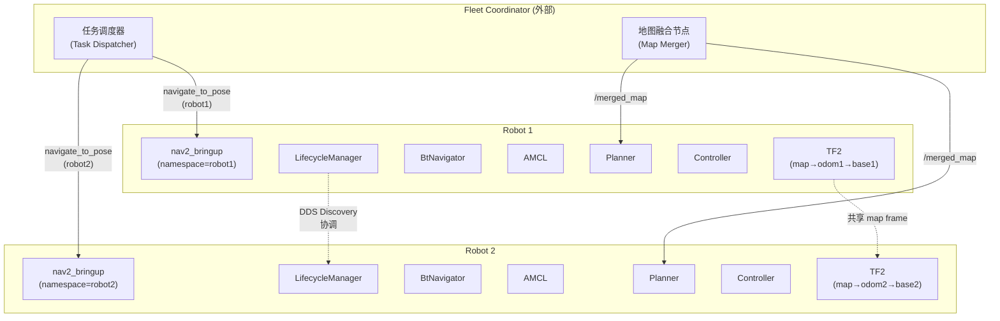

**关键实践**：
- 每个机器人使用 **namespace** 隔离（`robot1/`, `robot2/`）
- 共享 `/map` topic（全局规划使用同一地图）
- 各自维护独立的 local costmap（基于各自传感器）
- TF 的 `map` frame 必须共享，但 `odom` 和 `base_link` 必须各自独立
- 使用 **DDS Domain** 隔离不同车队的流量
- 碰撞协调由外部调度器（Open-RMF、Fleet Manager）负责

### 6.2 Dock Server（自动充电对接）

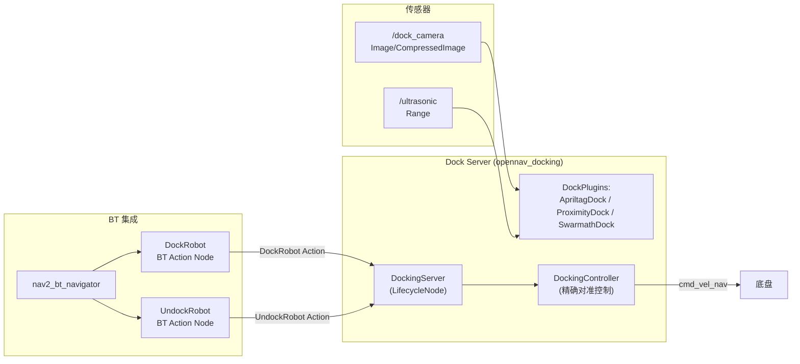

### 6.3 Route Server（图优化路径规划）

Route Server 建立在 **图（Graph）** 而非自由空间搜索之上，适用于结构化环境：

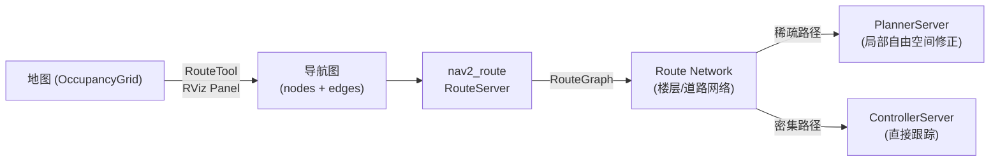

**优势场景**：
- 多楼层建筑（电梯节点连接各楼层子图）
- 仓库车道网络（固定路线，效率最优）
- 大范围室外园区（降低全局搜索开销）

### 6.4 Elevation Mapping（3D 地形感知）

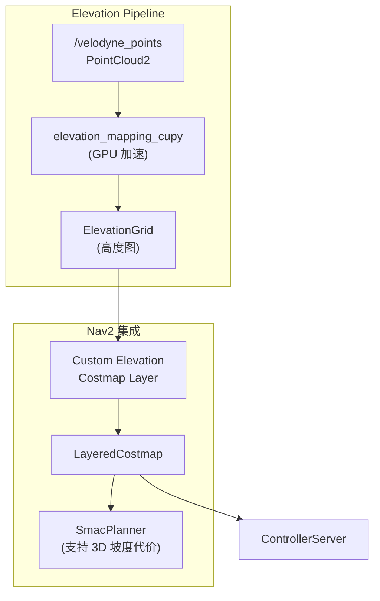

---

## 7. 调试与诊断

### 7.1 GDB 断点调试

```bash
# 方法1：xterm + GDB
ros2 launch nav2_bringup bringup_launch.py \
  prefix:='xterm -e gdb -ex run --args'

# 方法2：GDB attach 到运行中的进程
gdb -p $(pidof bt_navigator)
(gdb) break BtNavigator::onExecute
(gdb) continue

# 方法3：backward_ros 自动 backtrace（已默认集成）
# 崩溃时自动打印调用栈
```

**BtNavigator 关键断点**：
```
nav2_bt_navigator/src/bt_navigator.cpp:
  - BtNavigator::onExecute()           # 行为树执行主循环
  - BtNavigator::getCurrentPose()     # 获取当前位姿
  - NavigatorBase::navigateToPose()    # 接收导航目标入口

nav2_behavior_tree/src/behavior_tree_engine.cpp:
  - BehaviorTreeEngine::run()          # 行为树 Tick 引擎
```

**ControllerServer 关键断点**：
```
nav2_controller/src/controller_server.cpp:
  - ControllerServer::computeAndPublishVelocity()  # 速度计算主循环
  - ControllerServer::computeVelocityCmd()          # 实际调用控制器插件
```

### 7.2 Lifecycle 状态机调试

```bash
# 列出所有 lifecycle 节点及其当前状态
ros2 lifecycle list /bt_navigator
ros2 lifecycle list /controller_server
ros2 lifecycle list /planner_server

# 手动触发状态转换（用于排查故障）
ros2 service call /bt_navigator/change_state \
  lifecycle_msgs/srv/ChangeState "{transition: {label: deactivate}}"

# 查看所有节点状态
ros2 lifecycle list /lifecycle_manager

# 导出当前 lifecycle 状态机配置
ros2 param dump /bt_navigator > bt_navigator_params.yaml
```

### 7.3 行为树诊断

```bash
# 订阅行为树执行日志
ros2 topic echo /behavior_tree_log --csv

# 查看当前加载的 BT XML 哈希（验证 XML 是否更新）
ros2 param get /bt_navigator current_bt_xml_filename

# 运行时切换 BT XML（无需重启 Nav2）
ros2 service call /bt_navigator/load_predefined_bt \
  nav2_msgs/srv/LoadPredefinedBt "{bt_xml_filename: navigate_to_pose_w_replanning_and_recovery.xml}"

# Groot ZMQ 连接调试
ros2 run nav2_behavior_tree compute_groot_version
```

### 7.4 TF 诊断

```bash
# 查看完整 TF 树
ros2 run tf2_tools view_frames

# 监听特定 TF 变换
ros2 run tf2_ros tf2_echo map base_link

# 检查 TF 缓存延迟
ros2 run tf2_tools dump_ros2_cache

# 常见问题排查：
#   - 缺失 map → odom: AMCL 未启动或未设初始位姿
#   - 缺失 odom → base_link: 底盘驱动未发布 odom
#   - 缺失 base_link → laser: 雷达 TF 未广播
```

---

## 8. 性能优化

### 8.1 Composition（进程内组合）

默认 Nav2 以**多进程**模式运行。Composition 模式将多个服务器组合到同一进程内，通过 **intra-process 通信**（零拷贝共享内存）传递数据，大幅降低延迟和 CPU 开销。

```bash
# 启动组合模式
ros2 launch nav2_bringup bringup_launch.py \
  use_composition:=True \
  autostart:=True
```

**性能提升预期**：
- IPC 延迟：降低 50-80%（取决于 topic 负载）
- CPU 使用率：降低 10-20%（减少了进程上下文切换）
- 内存：略微降低（共享库的代码段）

**注意事项**：
- 某个组件崩溃可能导致整个进程退出（没有进程隔离）
- 调试更困难（单进程内的多个节点）
- Bond 机制的 topic 路径可能需要调整

### 8.2 Multi-Threaded Executor

```yaml
# 在 launch 文件中为各服务器配置线程数
ComposableNode(
    package='nav2_controller',
    plugin='nav2_controller::ControllerServer',
    name='controller_server',
    extra_arguments=[
        {'use_intra_process_comms': True},
        {'start_type_descriptions': True}
    ],
    parameters=[...],
    node_options=[
        {'cpup_affinity': [2, 3]},     # CPU 亲和性
        {'callback_group': 'reentrant'} # 可重入回调组（允许多线程并发）
    ]
)
```

**线程亲和性建议**：
- ControllerServer（高频控制循环）：固定到专用 CPU 核心，避免调度干扰
- PlannerServer（计算密集）：可与控制器共享核心
- BT Navigator（事件驱动）：较低优先级，可共享

### 8.3 Real-Time Priority（实时优先级）

```bash
# 使用 SCHED_FIFO 实时调度（需 root 权限）
chrt -f 80 ros2 run nav2_controller controller_server
```

**注意**：
- 需要 root 权限或 `CAP_SYS_NICE` capability
- 与非实时线程共用核心可能导致优先级反转
- 生产环境建议使用 PREEMPT_RT 内核补丁

### 8.4 性能瓶颈定位

```bash
# 监控 topic 发布频率（发现欠频问题）
ros2 topic hz /cmd_vel
ros2 topic hz /plan
ros2 topic hz /scan

# 监控 topic 带宽
ros2 topic bandwidth /scan
ros2 topic bandwidth /costmap

# ControllerServer 内部计时分析
ros2 param set /controller_server enable_measuring_time True
```

---

## 9. 源码阅读目标问题清单

### 架构层

1. **LifecycleManager 如何保证启动顺序的确定性？** 追踪 `nav2_lifecycle_manager/src/lifecycle_manager.cpp` 中 `startup()` 的节点遍历逻辑，以及 `transition_to()` 的实现
2. **Bond 机制的具体实现**：`nav2_util/lifecycle_node.cpp` 中的 `createBond()` 与 `bond` 包（`ros-planning/bond`）中 `Bond` 类的交互
3. **BtNavigator 如何加载多个 Navigator 插件**：从 `plugin_lib_names` 参数到 `pluginlib::ClassLoader` 的完整路径

### PlannerServer 层

4. **PlannerServer 如何处理多插件切换**：追踪 `plugin_map_.at(request.plugin_name)` 的动态分发逻辑
5. **NavFn 的栅格路径搜索算法**：`nav2_navfn_planner` 中 Dijkstra/A* 的实现细节，以及 `NavFn::potential` 的计算
6. **SmacPlannerHybrid 的 Hybrid A* 实现**：如何在栅格上处理连续角度状态，考虑车辆最小转弯半径约束

### ControllerServer 层

7. **MPPI 控制器的采样-优化循环**：`nav2_mppi_controller` 中 `MotionModel`、`Critics` 权重计算和 `controlT` 的生成过程
8. **DWB 的 Trajectory Rollout vs. MPPI 的 Path Integral**：两种采样策略的计算复杂度分析和适用场景
9. **GoalChecker 与 ProgressChecker 的调用时机**：在 `computeVelocityCommands()` 中何时检查 goal tolerance，何时触发恢复

### Costmap 层

10. **VoxelLayer 的 3D raycasting 实现**：`nav2_costmap_2d` 中 VoxelGrid 类的内存布局，以及如何投影到 2D
11. **InflationLayer 的加速结构**：是否使用 KD-Tree 或其他空间索引加速距离查询
12. **LayeredCostmap 的 updateBounds() 边界传播**：上层 layer 的 updateBounds() 输出如何作为下层的输入边界

### BT 节点层

13. **BehaviorTree.CPP 的 Tick 传播算法**：tick() 如何遍历树节点，以及 RUNNING 状态如何维持循环
14. **ComputePathToPose Action Node 的超时与取消处理**：`nav2_bt_navigator/plugins/action/compute_path_to_pose.cpp` 中 `wait_for_result()` 的取消传播
15. **自定义 BT 节点如何访问 Nav2 上下文**：通过 `config()` 方法传递的 `Blackboard` 共享状态

### 扩展层

16. **Collision Monitor 的多边形处理**：Shape Mobile 的最近点查询算法，以及与 costmap 的数据融合策略
17. **Route Server 的图搜索**：如何将 OccupancyGrid 转化为拓扑图，以及 graph-based planning 的搜索算法
18. **Open-RMF 的多机器人协调**：如何通过 Topic/Service 协调多 Nav2 实例的路径冲突

---

## 10. 参考资源

### 官方资源

| 资源 | 链接 | 优先级 |
|---|---|---|
| **GitHub 仓库** | https://github.com/ros-navigation/navigation2 | 必读 |
| **官方文档** | https://docs.nav2.org/ | 必读 |
| **DeepWiki** | https://deepwiki.com/ros-navigation/navigation2 | 推荐 |
| **Tuning Guide** | https://docs.nav2.org/tuning/index.html | 必读 |
| **Plugin Tutorials** | https://docs.nav2.org/plugin_tutorials/index.html | 必读 |
| **Configuration Guide** | https://docs.nav2.org/configuration/index.html | 参考 |

### 源码关键路径

```
ros-navigation/navigation2
├── nav2_bt_navigator/
│   ├── src/bt_navigator.cpp          # 行为树导航器核心
│   ├── include/nav2_bt_navigator/bt_navigator.hpp
│   └── plugins/action/               # BT Action 节点（ComputePath, FollowPath, Spin, BackUp...）
├── nav2_behavior_tree/
│   ├── src/behavior_tree_engine.cpp  # BT 引擎
│   ├── include/nav2_behavior_tree/
│   └── plugins/                      # Condition / Decorator 节点
├── nav2_planner/
│   ├── src/planner_server.cpp
│   └── include/nav2_planner/
├── nav2_controller/
│   ├── src/controller_server.cpp
│   ├── include/nav2_controller/
│   └── src/mppi_controller/          # MPPI 控制器实现
├── nav2_costmap_2d/
│   ├── src/layered_costmap.cpp
│   ├── src/inflation_layer.cpp
│   ├── src/obstacle_layer.cpp
│   ├── src/voxel_layer.cpp
│   └── include/nav2_costmap_2d/
├── nav2_lifecycle_manager/
│   ├── src/lifecycle_manager.cpp     # 生命周期管理 + Bond
│   └── src/lifecycle_manager_client.cpp
├── nav2_core/
│   ├── include/nav2_core/controller.hpp
│   ├── include/nav2_core/planner.hpp
│   ├── include/nav2_core/behavior.hpp
│   └── include/nav2_core/navigator_base.hpp
└── nav2_util/
    └── src/lifecycle_node.cpp        # Bond 创建/销毁封装
```

### 扩展生态

| 项目 | 用途 | 链接 |
|---|---|---|
| **opennav_docking** | 自动充电对接 | https://github.com/open-navigation/opennav_docking |
| **nav2_route** | 图优化路径规划 | https://github.com/open-navigation/nav2_route |
| **nav2_graceful_controller** | 平滑停车控制 | https://github.com/open-navigation/nav2_graceful_controller |
| **elevation_mapping_cupy** | GPU 加速地形高度映射 | https://github.com/tuc tout/elevation_mapping_cupy |
| **Open-RMF** | 多机器人协调调度 | https://github.com/open-rmf/rmf |
| **BehaviorTree.CPP** | 行为树引擎（上游） | https://www.behaviertrees.com/ |

### 社区资源

| 资源 | 说明 |
|---|---|
| ROS Discourse - Navigation | 最新讨论、Bug 报告、参数调优经验 |
| nav2_issues (GitHub) | 已知问题追踪，v2 → v3 参数迁移指南 |
| Groot 2.x | 行为树可视化调试工具 |
| Foxglove | Nav2 调试（TF 可视化、costmap 回放） |

---

## 附录：快速命令速查

```bash
# === 启动 ===
ros2 launch nav2_bringup bringup_launch.py \
  use_composition:=True \
  autostart:=True \
  params_file:=/path/to/nav2_params.yaml

# === Lifecycle ===
ros2 lifecycle list /bt_navigator
ros2 lifecycle set /bt_navigator deactivate
ros2 lifecycle set /bt_navigator cleanup

# === TF ===
ros2 run tf2_tools view_frames
ros2 run tf2_ros tf2_echo map base_link

# === 行为树 ===
ros2 topic echo /behavior_tree_log
ros2 service call /bt_navigator/load_predefined_bt \
  nav2_msgs/srv/LoadPredefinedBt '{bt_xml_filename: "..."}'

# === 性能 ===
ros2 topic hz /cmd_vel /scan /plan
ros2 topic bw /scan

# === 调试 ===
ros2 param dump /controller_server
ros2 run rqt_graph rqt_graph
ros2 run rqt_reconfigure rqt_reconfigure
```

---

*本学习指南由 AI 自动生成，综合了 Web 搜索（社区实践）与 DeepWiki（官方架构）双重信息源，面向专家级读者。*
