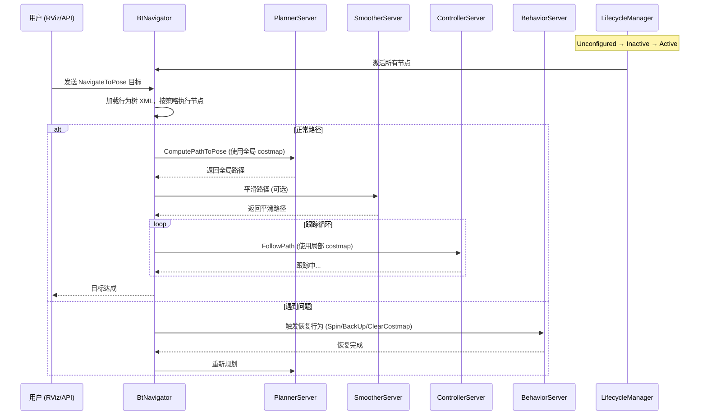
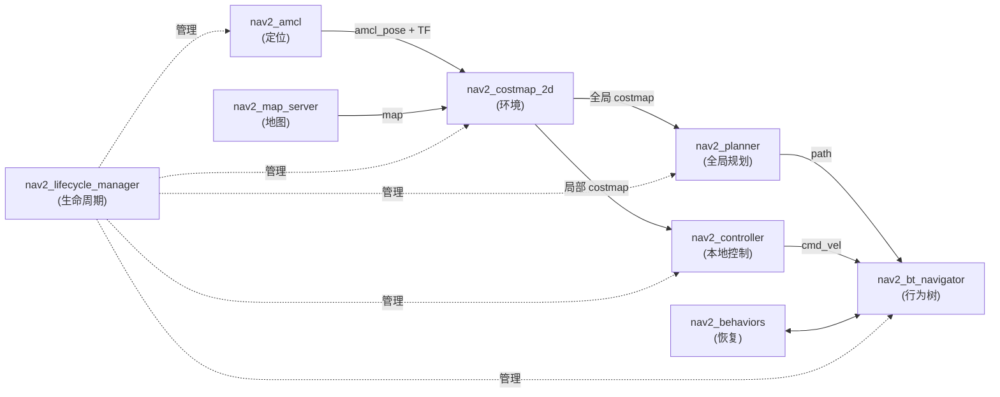

# Navigation2 (Nav2) 学习指南

> 生成时间：2026-03-26
> 项目仓库：https://github.com/ros-navigation/navigation2
> 目标读者：初学者（Beginner）

---

## 目录

- [项目概述](#项目概述)
- [快速开始](#快速开始)
- [核心架构](#核心架构)
- [核心模块拆解](#核心模块拆解)
- [技术栈分析](#技术栈分析)
- [设计理念](#设计理念)
- [核心概念](#核心概念)
- [典型使用场景](#典型使用场景)
- [最佳实践与常见陷阱](#最佳实践与常见陷阱)
- [学习路径建议](#学习路径建议)
- [源码阅读目标问题清单](#源码阅读目标问题清单)
- [参考资源](#参考资源)
- [总结](#总结)

---

## 项目概述

### 项目简介

Navigation2（简称 Nav2）是 ROS 2 的官方机器人自主导航框架，是 ROS 1 时代 `move_base` 的完整重写与升级版。它由一组模块化的服务器（Server）、算法插件和工具组成，赋予移动机器人在已知或部分未知环境中从起点安全移动到目标点的能力，同时避开静态和动态障碍物。

Nav2 的核心设计哲学是**插件化、可扩展、生命周期管理**：每个功能单元（规划器、控制器、恢复行为等）都是独立的热插拔插件，由**行为树（Behavior Tree）** 统一编排生命周期。

### 解决的问题

| 核心问题 | 子系统 | 代表包 |
|---|---|---|
| *我在哪里？* | 定位（Localization） | `nav2_amcl` |
| *周围环境是什么？* | 环境表示（Environment Representation） | `nav2_costmap_2d`, `nav2_map_server` |
| *如何规划路径？* | 全局规划（Global Planning） | `nav2_planner`, `nav2_smac_planner`, `nav2_navfn_planner` |
| *如何控制运动？* | 本地控制（Local Control） | `nav2_controller`, `nav2_mppi_controller`, `nav2_regulated_pure_pursuit_controller`, `nav2_dwb_controller` |

Nav2 还通过行为树（`nav2_bt_navigator`）编排上述子系统，决定何时重规划、何时执行恢复行为；通过 Lifecycle Manager（`nav2_lifecycle_manager`）管理所有节点的启动和关闭顺序。

### 适用场景

- 室内服务机器人（如餐厅、医院送物机器人）的自主导航
- 仓库 AMR（自主移动机器人）的路径规划与跟随
- 仿真环境中机器人导航算法的快速验证
- 室外低速车辆的自主导航（需配合传感器和地图）
- 科研中自定义导航行为、算法对比和插件开发

### 新手先知道什么

- **心智模型**：Nav2 不是单个算法，而是一个**模块化服务器集群**，由行为树作为"大脑"统一调度。把它想象成一家医院的各科室（CT室、药房、手术室），行为树是护士长，决定何时叫哪个科室。
- **范围边界**：Nav2 本身不负责 SLAM 建图（通常配合 Cartographer 或 SLAM Toolbox），也不负责底盘驱动。它站在定位（AMCL）和底层控制器之上，输出 `cmd_vel` 给下层驱动。
- **不要先关注的内容**：不要在入门阶段深入研究插件开发、C++ 模板或复杂的 DWB 调参。先把最小系统跑起来，理解整体流程。

---

## 快速开始

### 环境要求

| 要求 | 说明 |
|---|---|
| **ROS 2 版本** | Humble / Iron / Jazzy（建议从 Humble 开始，生态最成熟） |
| **操作系统** | Ubuntu 22.04（Jazzy）或 20.04（Humble） |
| **磁盘空间** | 建议 20GB+ |
| **其他工具** | Python 3.8+、colcon 构建工具、git |

### 安装与运行（以 TurtleBot3 仿真为例）

```bash
# 1. 安装 ROS 2（参考官方文档）
source /opt/ros/humble/setup.bash

# 2. 安装 Nav2 及 TurtleBot3 依赖
sudo apt update
sudo apt install ros-humble-navigation2 ros-humble-nav2-bringup \
  ros-humble-turtlebot3 ros-humble-turtlebot3-simulations

# 3. 设置 TurtleBot3 模型
echo 'export TURTLEBOT3_MODEL=burger' >> ~/.bashrc
source ~/.bashrc

# 4. 启动仿真导航（两种方式）

# 方式 A：使用 Nav2 官方 bringup
ros2 launch nav2_bringup bringup_launch.py \
  map:=/path/to/your/map.yaml \
  params_file:=/path/to/your/nav2_params.yaml

# 方式 B：使用 TurtleBot3 仿真（推荐入门）
export GAZEBO_MODEL_PATH=$GAZEBO_MODEL_PATH:/opt/ros/humble/share/turtlebot3_gazebo/models
ros2 launch turtlebot3_gazebo empty_world.launch.py

# 另一终端启动导航
ros2 launch nav2_bringup navigation_launch.py \
  params_file:=/opt/ros/humble/share/nav2_bringup/params/nav2_params.yaml \
  use_sim_time:=true

# 5. 在 RViz2 中操作
#   - 点击 "2D Pose Estimate" 标定机器人初始位置
#   - 点击 "Navigation2 Goal" 发送目标点
#   - 观察 costmap、路径和机器人运动
```

### 第一次运行时应观察什么

- RViz 中机器人是否显示在地图正确位置
- 点击 "2D Pose Estimate" 后粒子的收敛情况（AMCL 定位生效）
- 发送目标后 `ComputePathToPose` 是否生成了绿色路径
- 控制器是否持续输出速度指令（`/cmd_vel` topic 有数据）
- 路径跟踪过程中局部 costmap 的实时更新
- 机器人遇到障碍物时是否会触发恢复行为（原地旋转、后退）

---

## 核心架构

### 整体架构说明

Nav2 采用**分层模块化架构**，自底向上分为五层：

```
┌─────────────────────────────────────────────────────────┐
│                    用户层 (User Layer)                   │
│         Nav2Panel (RViz) / SimpleCommander API           │
└──────────────────────────┬──────────────────────────────┘
                           │ Action Client (NavigateToPose)
┌──────────────────────────▼──────────────────────────────┐
│               导航编排层 (Orchestration)                 │
│   nav2_bt_navigator (BtNavigator) + nav2_behavior_tree   │
│         ↑ 通过行为树 XML 调度以下所有服务器                │
└──────┬────────────┬────────────┬────────────┬─────────────┘
       │            │            │            │
┌──────▼──┐  ┌──────▼──┐  ┌──────▼──┐  ┌──────▼──────────┐
│ 定位层  │  │ 环境层   │  │ 全局规划 │  │ 本地控制        │
│ AMCL    │  │ Costmap  │  │ Planner  │  │ Controller      │
│ MapServer│ │ Collision│  │ Smoother │  │ Velocity Smoother│
└─────────┘  │ Monitor  │  └──────────┘  └─────────────────┘
┌──────────────────────────────────────────────────────────┐
│              恢复与行为层 (Recovery & Behaviors)           │
│       nav2_behaviors (Spin, BackUp, Wait, DriveOnHeading) │
└──────────────────────────────────────────────────────────┘
┌──────────────────────────────────────────────────────────┐
│             生命周期管理层 (Lifecycle Management)          │
│            nav2_lifecycle_manager (LifecycleManager)      │
│         管理所有节点的 Unconfigured→Inactive→Active       │
└──────────────────────────────────────────────────────────┘
┌──────────────────────────────────────────────────────────┐
│                底层依赖 (Lower Dependencies)               │
│     TF2 / ROS 2 Action / Costmap2D / nav2_msgs / rclcpp  │
└──────────────────────────────────────────────────────────┘
```

Nav2 的数据流遵循：`用户目标 → BT Navigator → PlannerServer → SmootherServer → ControllerServer → VelocitySmoother → cmd_vel → 底盘驱动`。其中任何环节失败，行为树都会触发恢复动作。

### 架构图

```mermaid
flowchart TD
    subgraph "用户层"
        RViz["nav2_rviz_plugins\nRViz Nav2Panel"]
        SC["nav2_simple_commander\nBasicNavigator API"]
    end

    subgraph "导航编排"
        BT["nav2_bt_navigator\nBtNavigator"]
        BTLib["nav2_behavior_tree\nBehaviorTreeEngine"]
    end

    subgraph "定位与环境"
        AMCL["nav2_amcl\nAmclNode"]
        Costmap["nav2_costmap_2d\nLayeredCostmap"]
        MapServer["nav2_map_server\nMapServer"]
        ColMon["nav2_collision_monitor\nCollisionMonitor"]
    end

    subgraph "服务器层"
        PS["nav2_planner\nPlannerServer"]
        CS["nav2_controller\nControllerServer"]
        Beh["nav2_behaviors\nSpin/BackUp/Wait"]
        WF["nav2_waypoint_follower\nWaypointFollower"]
    end

    subgraph "插件层"
        NavFn["nav2_navfn_planner\nNavfnPlanner"]
        Smac["nav2_smac_planner\nSmacPlannerHybrid/2D"]
        RPP["nav2_regulated_pure_pursuit_controller"]
        MPPI["nav2_mppi_controller\nMPPIController"]
        DWB["nav2_dwb_controller\nDWBLocalPlanner"]
    end

    subgraph "基础设施"
        LM["nav2_lifecycle_manager\nLifecycleManager"]
        TF["TF2 Transform System\nmap→odom→base_link"]
    end

    RViz -->|"NavigateToPose Action"| BT
    SC -->|"NavigateToPose Action"| BT
    BT -->|"calls| BTLib
    BT -->|"ComputePathToPose"| PS
    BT -->|"FollowPath"| CS
    BT -->|"Spin/BackUp"| Beh

    PS -->|"plugin"| NavFn
    PS -->|"plugin"| Smac
    CS -->|"plugin"| RPP
    CS -->|"plugin"| MPPI
    CS -->|"plugin"| DWB

    AMCL -->|"amcl_pose| Costmap
    MapServer -->|"map| Costmap
    Costmap -->|"costmap| PS
    Costmap -->|"costmap| CS

    LM -->|"lifecycle management"| AMCL
    LM -->|"lifecycle management"| Costmap
    LM -->|"lifecycle management"| PS
    LM -->|"lifecycle management"| CS
    LM -->|"lifecycle management"| BT

    CS -->|"cmd_vel"| TF
```

### 运行流程 / 数据流图



### 架构理解要点

1. **行为树是入口，不是算法**：BtNavigator 本身不计算路径或速度，它是一个**决策编排器**，负责按行为树定义的逻辑调用各服务器。理解这一点后，调试和扩展会变得清晰。
2. **服务器之间通过 Action 通信**：PlannerServer、ControllerServer、BehaviorServer 都以 ROS 2 Action 的方式被 BT 调用。Action 的异步特性使得服务器可以独立运行、动态替换。
3. **Lifecycle Manager 保证可靠性**：所有节点必须经过 lifecycle 状态机（Unconfigured → Inactive → Active → Finalized），避免了 ROS 1 中 `move_base` 启动顺序混乱导致的各种玄学问题。
4. **插件化是核心扩展机制**：全局规划、本地控制、BT 节点、成本地图层等全部支持插件热插拔，无需修改核心代码即可替换算法实现。

---

## 核心模块拆解

| 模块/子系统 | 主要职责 | 为什么重要 | 依赖/协作对象 | 建议阅读优先级 |
|---|---|---|---|---|
| **nav2_bt_navigator** | 加载并执行行为树，接收导航目标，调度各服务器 | 整个系统的"大脑"，决定导航逻辑和恢复策略 | nav2_behavior_tree, nav2_planner, nav2_controller, nav2_behaviors | **高** |
| **nav2_planner** (PlannerServer) | 使用全局 costmap 计算从当前位置到目标的路径 | 回答"全局最优路线是什么" | nav2_costmap_2d, nav2_navfn_planner / nav2_smac_planner | **高** |
| **nav2_controller** (ControllerServer) | 使用局部 costmap 实时跟踪路径，输出 cmd_vel | 回答"如何安全平滑地跟踪路径" | nav2_costmap_2d, nav2_mppi_controller / nav2_regulated_pure_pursuit_controller / nav2_dwb_controller | **高** |
| **nav2_costmap_2d** (LayeredCostmap) | 生成并维护全局/局部代价地图，融合静态地图和传感器数据 | 所有规划和控制决策的基础输入 | nav2_voxel_grid, sensor plugins | **高** |
| **nav2_amcl** | 粒子滤波定位，估计机器人在地图中的位姿 | 回答"机器人当前精确位置" | map_server, laser_scan | **高** |
| **nav2_lifecycle_manager** | 管理所有节点的生命周期状态和激活顺序 | 系统可靠性基础，确保各服务器按序启动 | 所有 Nav2 节点 | **中** |
| **nav2_behaviors** | 提供恢复行为（Spin, BackUp, Wait, DriveOnHeading） | 导航失败时的Fallback机制 | bt_navigator | **中** |
| **nav2_smoother** | 对规划路径进行平滑处理 | 提高路径可执行性，减少急转弯 | nav2_planner | **中** |
| **nav2_collision_monitor** | 实时检测近障碍，超速或停车 | 最后一道安全防线 | nav2_costmap_2d | **中** |
| **nav2_simple_commander** | Python API，提供 BasicNavigator 类 | 简化程序化导航任务的编写 | bt_navigator | **中** |
| **nav2_waypoint_follower** | 按顺序执行多个目标点航点 | 多点巡检、巡逻等场景 | bt_navigator | **低** |
| **nav2_velocity_smoother** | 对 cmd_vel 进行平滑和限幅 | 改善运动流畅性 | nav2_controller | **低** |
| **nav2_map_server** | 提供静态地图服务 | 全局规划和定位的地图来源 | 外部建图工具（Cartographer/SLAM Toolbox） | **中** |

### 模块关系图



### 重点模块深入理解

#### 1. nav2_bt_navigator（行为树导航器）

- **核心职责**：实现 `NavigateToPose`、`NavigateThroughPoses` 等 Action 接口；加载 XML 格式的行为树定义文件；按策略执行行为树节点，调用下层服务器。
- **输入输出**：输入为 `NavigateToPose.action` 目标（目标位姿）；通过行为树调用 `ComputePathToPose`（Planner）、`FollowPath`（Controller）、恢复行为；输出为 Action 结果或反馈。
- **关键抽象**：BtNavigator 类配合 BehaviorTreeEngine；行为树节点分为 Control（Sequence, Fallback, RateFallback）、Action（调用 ActionServer）、Condition（检查条件）；默认行为树路径 `nav2_bringup/params/nav2_waffle.yaml`。
- **为什么先学它**：它是理解 Nav2 整体逻辑的捷径。看懂行为树 XML，就知道导航"决策逻辑"是怎么写的，几乎所有高级定制都从这里开始。

#### 2. nav2_planner（全局规划器服务器）

- **核心职责**：接收目标点，使用全局 costmap 计算最优路径；支持多个规划插件（NavFn, SmacPlanner, ThetaStar 等）热切换。
- **输入输出**：输入为 `nav2_msgs/ComputePathToPose.action`（起点、终点、使用哪个 costmap）；输出为 `nav_msgs/Path`（几何路径）。
- **关键抽象**：`PlannerServer` 基类定义插件接口 `createPlanner()`；路径代价通过 costmap 单元格代价累加计算；支持动态参数更新。
- **为什么先学它**：它是导航流程中第一个被调用的计算模块，也是最容易验证正确性的模块（输入目标 → 输出路径）。

#### 3. nav2_controller（控制器服务器）

- **核心职责**：接收全局路径，使用局部 costmap 实时跟踪；输出 `geometry_msgs/Twist` 速度指令到 `/cmd_vel`。
- **输入输出**：输入为 `nav2_msgs/FollowPath.action`（全局路径、目标容差）；输出为 `geometry_msgs/Twist` 到 `/cmd_vel`。
- **关键抽象**：`ControllerServer` 加载控制器插件；控制器需要处理机器人运动学约束（全向/差速/阿克曼）；局部路径跟踪在每次控制周期（通常 10-20Hz）内完成。
- **为什么先学它**：它是实际产生机器人运动指令的模块，也是调参工作最密集的地方。理解控制器的工作方式，有助于解决"机器人抖动"、"跟踪不稳"等实际问题。

#### 4. nav2_costmap_2d（代价地图）

- **核心职责**：维护 2D 栅格地图，每格存储代价值（0=自由，254=膨胀障碍，255=占用）；分为全局 costmap（大范围、低频更新）和局部 costmap（小范围、滚动窗口、高频更新）。
- **输入输出**：输入为传感器数据（laser_scan, pointcloud）、静态地图；输出为 `nav_msgs/OccupancyGrid` 和可用于查询的 LayeredCostmap API。
- **关键抽象**：Costmap 由多个 Layer 插件叠加而成——StaticLayer（静态地图）、ObstacleLayer（传感器障碍）、InflationLayer（障碍膨胀）、VoxelLayer（3D 体素）；LayeredCostmap 类统一管理所有层。
- **为什么先学它**：它是所有规划和控制决策的输入源头。初学者很多"撞墙"、"路径不通"问题其实来自 costmap 配置错误（inflation_radius 过小、传感器未注册等）。

---

## 技术栈分析

| 技术 / 框架 | 用途 | 出现位置 | 为什么重要 |
|---|---|---|---|
| **ROS 2 (rclcpp/rclpy)** | 机器人中间件框架 | 全系统基础 | 提供节点通信、Action、Lifecycle、TF2 等所有底层能力 |
| **BehaviorTree.CPP** | 行为树引擎 | nav2_behavior_tree | 替代 ROS 1 的状态机，提供层级化、模块化、可视化的导航决策逻辑 |
| **TF2** | 坐标变换系统 | map→odom→base_link→sensor_frame | 所有导航模块依赖 TF 树确定空间位置关系；TF 不通则全不通 |
| **nav2_msgs** | Nav2 专用消息/Action 定义 | nav2_msgs/action/*.action | 定义 NavigateToPose、ComputePathToPose、FollowPath 等核心接口 |
| **Lifecycle Node** | ROS 2 节点状态管理 | nav2_lifecycle_manager | 保证 Nav2 各服务器可靠启动/关闭，替代 ROS 1 的无序启动 |
| **Pluginlib** | 插件加载框架 | 所有 Server（planner/controller/costmap） | 实现热插拔：换算法不换代码，Nav2 扩展性的核心机制 |
| **Costmap2D** | 2D 栅格地图库 | nav2_costmap_2d | 全局/局部环境表示的通用数据结构 |
| **nav2_core** | 核心抽象接口定义 | nav2_core/include | 定义 Planner、Controller、Behavior 等插件基类接口 |
| **colcon** | ROS 2 构建工具 | 构建系统 | 编译和管理所有 Nav2 包 |
| **Groot** | 行为树可视化调试工具 | 外部工具 | 实时可视化 BT 执行状态，是调试导航逻辑的必备工具 |

### 关键依赖

- **ROS 2 核心通信**：Action、Service、Publisher/Subscriber、Parameter
- **sensor_msgs**：LaserScan、PointCloud2（环境感知输入）
- **nav_msgs**：Odometry（里程计）、Path（规划路径）、OccupancyGrid（代价地图）
- **geometry_msgs**：PoseStamped（目标位姿）、Twist（速度输出）
- **tf2_ros**：TransformListener/Buffer（坐标变换）

---

## 设计理念

### 核心原则

1. **关注点分离（Separation of Concerns）**：规划、控制、恢复、定位各自独立为服务器插件，通过行为树组合而非硬编码。这使得每个模块可以独立开发、测试和替换。
2. **插件化可扩展（Plugin-Based Extensibility）**：全局规划、本地控制、BT 节点、Costmap 层均可通过 Pluginlib 热插拔。社区提供了 NavFn、SMAC、Theta* 等多种规划器，以及 MPPI、Regulated Pure Pursuit、DWB 等多种控制器。
3. **生命周期管理（Lifecycle Management）**：所有节点必须经过显式状态转换，确保启动顺序和错误恢复的确定性。
4. **异步通信（Asynchronous Communication）**：服务器之间通过 ROS 2 Action 异步通信，支持超时、取消和进度反馈。
5. **基于 TF2 的空间推理**：统一的坐标变换框架，所有位姿和路径都在特定坐标系下表示和处理。

### 常见设计模式 / 组织方式

- **策略模式（Strategy Pattern）**：ControllerServer 通过加载不同控制器插件实现不同跟踪策略（MPPI 追求能耗最优、Pure Pursuit 适合曲线跟踪）。
- **装饰器模式（Decorator Pattern）**：Costmap Layer 可以嵌套叠加（ObstacleLayer 包裹 InflationLayer），无需修改基础类。
- **工厂模式（Factory Pattern）**：Pluginlib 根据参数动态创建 Planner/Controller 实例。
- **观察者模式（Observer Pattern）**：Lifecycle Manager 通过 Bond 机制监控从属节点健康状态，节点退出时触发连锁关闭。

### 架构权衡

| 权衡点 | 描述 |
|---|---|
| **模块化 vs. 复杂度** | Nav2 的插件化带来了灵活性，但初学者需要理解多层间接调用（BT→Server→Plugin）才能调试问题 |
| **XML 行为树 vs. 代码逻辑** | 行为树使逻辑可视化、可配置，但也引入了 XML 配置文件的学习成本 |
| **生命周期管理 vs. 启动便捷性** | Lifecycle 确保可靠性，但手动管理节点状态比 ROS 1 的简单启动脚本更繁琐 |
| **多算法插件 vs. 默认选择困难** | 提供了多个规划器和控制器，但初学者往往不知道该选哪个、如何调参 |

---

## 核心概念

### Costmap（代价地图）

**定义**：一种 2D 栅格地图，每个单元格存储一个代价值（0=自由空间，254=膨胀障碍区，255=实际占用）。机器人仅在代价值低于阈值的区域运动。

**为什么重要**：它是所有导航决策的基础输入——全局规划器在全局 costmap 上搜索最优路径；控制器在局部 costmap 上进行实时避障。代价地图的质量直接决定导航成功率。

**Global Costmap vs. Local Costmap**：

- **Global**：大范围（整个地图或几十米半径），低频更新（静态地图为基础），用于全局路径规划
- **Local**：小范围（机器人周围 3-5 米滚动窗口），高频更新（传感器实时融合），用于实时避障

**Inflation Layer**：在每个实际障碍周围"膨胀"一圈高代价区域。膨胀半径（`inflation_radius`）越大，机器人越保守，距离障碍越远；太小则容易碰撞。调参时优先调整这个参数。

**学习顺序**：先理解"代价值"概念 → 再理解"层叠加"机制 → 最后理解各层如何注册传感器数据。

### Behavior Tree（行为树）

**定义**：一种树状决策框架（根节点向下Tick），用 XML 定义。每个节点返回 SUCCESS / FAILURE / RUNNING 三种状态。节点分为：Control（Sequence, Fallback, Parallel, RateDecorator）、Action（调用外部 Action Server）、Condition（检查条件）。

**为什么重要**：Nav2 用它替代 ROS 1 `move_base` 的硬编码状态机，实现更灵活的导航逻辑——可以随时重规划、可以在失败时执行复杂恢复序列、可以通过修改 XML 添加新行为。

**常用节点类型**：

| 节点类型 | 作用 | 示例 |
|---|---|---|
| `Sequence` | 依次执行子节点，全部成功才返回成功 | 规划→跟踪 |
| `Fallback`（ReactiveFallback） | 尝试第一个，失败则尝试第二个 | 正常跟踪→恢复→重规划 |
| `RateFallback` / `DistanceController` | 控制Tick频率或触发条件 | 每 N 秒或每 M 米重规划 |
| `ComputePathToPose` | 调用 PlannerServer 计算路径 | 全局规划 |
| `FollowPath` | 调用 ControllerServer 跟踪路径 | 本地控制 |
| `IsPathValid` / `GoalReached` | 条件判断节点 | 检查是否到达目标 |

**学习建议**：用 [Groot](https://www.behaviertrees.com/) 可视化工具打开默认 BT XML 文件，边看图边理解执行逻辑。

### Lifecycle（生命周期节点）

**定义**：ROS 2 的 Lifecycle Node 机制要求节点显式管理状态转换：`Unconfigured` → `Inactive` → `Active` → `Finalized`。Transition 由 LifecycleManager 按序触发。

**为什么重要**：Nav2 的可靠性很大程度上来自这个机制——避免节点在未就绪时接收数据；确保传感器先于规划器启动；Bond 机制保证节点崩溃时能触发连锁关闭。

**初始状态**：`Unconfigured`（配置未加载）→ `configure()` → `Inactive`（可读取参数但不能处理数据）→ `activate()` → `Active`（正常工作）→ `deactivate()` / `cleanup()` → `shutdown()`。

**初学者注意**：当你看到 `nav2_lifecycle_manager / lifecycle_manager: Cannot transition from unconfigured state` 错误时，意味着某个从属节点未能成功 configure，可能是参数文件路径错误或依赖未就绪。

### TF2 Transform System

**定义**：ROS 2 的坐标变换库，维护一个所有坐标系之间变换关系的有向图。Nav2 依赖的核心变换链为 `map → odom → base_link → [sensor_frames]`。

**为什么重要**：

- `map → odom`：AMCL 或 SLAM 节点发布，表示定位结果（机器人相对于地图的漂移校正）
- `odom → base_link`：底盘驱动发布，表示里程计（航位推算）
- `base_link → laser`：雷达外参 TF，表示雷达在机器人本体坐标系下的位置

**常见问题**：如果 TF 树不完整（如缺少 `map → odom`），则 costmap 无法初始化，所有规划服务器都会报错。

### Action Server Pattern（动作服务器模式）

**定义**：Nav2 各服务器（Planner、Controller、Behavior）均以 ROS 2 Action 方式提供服务。Action 是异步的，支持目标提交、进度反馈、取消和结果返回。

**为什么重要**：Action 的 Goal-Feedback-Result 三段式结构非常适合导航场景——可以取消正在执行的任务；可以实时反馈进度（如跟踪了多少比例的路径）；可以在超时时自动触发恢复。

---

## 典型使用场景

### 基础场景：单点导航

机器人已知地图，初始位姿已标定（AMCL），用户通过 RViz 发送一个 `NavigateToPose` 目标，机器人自主规划路径并运动到目标点。

```
用户点击 RViz "Navigation2 Goal"
  → BtNavigator 接收 NavigateToPose 目标
  → 行为树执行 ComputePathToPose（PlannerServer）
  → 行为树执行 FollowPath（ControllerServer）
  → ControllerServer 输出 cmd_vel
  → 机器人底盘执行运动
  → 局部 costmap 实时更新，控制器实时避障
  → 到达目标 → Action 返回 SUCCEEDED
```

### 进阶场景：多点巡检（Waypoint Following）

需要机器人依次访问 N 个航点，每个航点到达后执行额外动作（如停靠充电、拍照）。使用 `nav2_waypoint_follower` 或自定义行为树实现。

### 进阶场景：动态障碍重规划

机器人在跟踪路径过程中，前方突然出现行人。局部 costmap 检测到障碍 → 控制器减速或停车 → 行为树触发 RateFallback 或重规划 → 生成新路径绕过障碍。

### 阅读源码时最值得对应的场景

最值得对应的是"正常路径跟踪"这一基础场景：行为树 Tick → ComputePathToPose → FollowPath → cmd_vel 输出。顺着这条链路读下去，可以理解 Nav2 的核心抽象——ActionServer 作为计算单元、插件作为算法实现、Lifecycle 作为生命周期容器。

---

## 最佳实践与常见陷阱

### 推荐做法

1. **从仿真入手，先跑通最小系统**：使用 TurtleBot3 Gazebo 仿真验证一切正常，再迁移到真实机器人。
2. **增量修改参数，每次只改一个**：Nav2 参数众多（costmap、planner、controller 各有一组），修改时遵循"单变量"原则，便于定位问题。
3. **用 Groot 可视化行为树**：调试导航逻辑时，用 Groot 连接 BT Navigator 的 ZMQ 端口，实时观察行为树执行到哪个节点。
4. **TF 优先排查**：任何奇怪的问题（规划失败、costmap 不显示）先查 TF 树是否完整，用 `ros2 run tf2_tools view_frames` 和 `ros2 tf2_echo` 排查。
5. **理解 use_sim_time 一致性**：仿真必须为 `true`，实车必须为 `false`，混用会导致时间不同步。
6. **保存和复用参数文件**：用 `nav2_bringup/params/nav2_params.yaml` 作为基础，按机器人特性逐步调整。

### 常见陷阱

| 陷阱 | 描述 | 解决方案 |
|---|---|---|
| **TF 树断裂** | 启动顺序问题导致 `map → odom` 或 `odom → base_link` 缺失 | 检查启动顺序；AMCL 需要先设置初始位姿；用 `tf2_tools view_frames` 验证 |
| **未设初始位姿** | AMCL 未收到 "2D Pose Estimate"，定位未初始化 | 启动后在 RViz 中先标定初始位置；发布 `/initialpose` topic |
| **inflation_radius 过小** | 机器人紧贴障碍物运动，容易碰撞 | 通常设为机器人最大尺寸的 1.5-2 倍 |
| **local_costmap 尺寸不合适** | 太小：来不及感知障碍；太大：计算开销高 | 设为机器人尺寸的 3-5 倍，分辨率 0.05m |
| **costmap 层未注册传感器** | 障碍层收不到传感器数据，无法感知环境 | 在 costmap 参数的 `plugins` 列表中添加对应传感器源 |
| **Lifecycle 激活顺序错误** | 节点间依赖关系未满足导致崩溃 | 使用 `nav2_bringup` 提供的 launch 文件，不要手动创建 lifecycle 链 |
| **DDS 节点发现失败** | 多机或仿真中节点互相找不到 | 统一 `ROS_DOMAIN_ID`；确保所有终端 `source /opt/ros/<distro>/setup.bash` |
| **参数名跨版本不兼容** | Humble → Jazzy 参数 API 变化导致加载失败 | 参考对应 ROS 2 发行版的官方参数文件，不要混用 |

### 初学者不要过早关注的内容

- **自定义插件开发**：先理解插件接口和已有插件的行为，再写自己的 Planner/Controller。
- **多机器人协调**：先搞定单车导航，再考虑多机调度。
- **复杂 Costmap Layer 开发**：ObstacleLayer、VoxelLayer 的底层原理可以暂时跳过，先用好 StaticLayer + InflationLayer。
- **阿克曼运动学适配**：默认示例多为差速机器人，阿克曼底盘需要额外配置 kinematic model。

---

## 学习路径建议

| 阶段 | 学习目标 | 建议阅读内容 | 完成标志 |
|---|---|---|---|
| **入门** | 理解 Nav2 能解决什么问题，整体由哪些模块组成，能跑通最小示例 | README + 官方文档 Overview + System Architecture + Getting Started 教程 | 能用 TurtleBot3 仿真完成点到点导航 |
| **进阶** | 理解行为树如何编排导航流程，各服务器的职责边界，能修改 BT XML 实现基本定制 | nav2_bt_navigator 源码 + 行为树 XML 文件 + nav2_bringup launch 文件 | 能修改行为树实现额外条件判断或恢复动作 |
| **深入** | 理解 Lifecycle 管理机制，插件加载过程，TF 树构建，能定位和解决实际问题 | nav2_lifecycle_manager 源码 + nav2_core 接口 + nav2_costmap_2d 层机制 | 能独立排查 TF/Costmap/Lifecycle 错误，能写简单插件 |
| **精通** | 掌握 Nav2 扩展点，能对比评估不同规划器/控制器，能进行生产级调参 | nav2_smac_planner, nav2_mppi_controller 源码 + 调参文档 | 能为特定机器人硬件选型并调优 Nav2 参数 |

### 分阶段清单

#### 入门阶段

- [ ] 理解 Nav2 与 ROS 1 move_base 的核心区别（插件化、行为树、生命周期）
- [ ] 安装 Nav2 + TurtleBot3 仿真环境并运行最小示例
- [ ] 在 RViz 中完成"初始位姿估计 → 发送导航目标"的完整流程
- [ ] 识别 RViz 中 costmap 全局/局部显示区域的差异
- [ ] 理解"TF 变换链"（map → odom → base_link）和它们各自的发布者
- [ ] 认识最核心的 3 个模块：BtNavigator、PlannerServer、ControllerServer

#### 进阶阶段

- [ ] 能读懂默认行为树 XML，理解 Sequence、Fallback、ComputePathToPose、FollowPath 节点的作用
- [ ] 理解 Lifecycle 状态机（Unconfigured → Inactive → Active）并能用 `ros2 lifecycle list` 查看节点状态
- [ ] 能为新机器人修改 Nav2 参数文件（base_frame、inflation_radius、controller 类型）
- [ ] 理解全局 costmap 和局部 costmap 的区别和使用场景
- [ ] 知道如何用 Groot 可视化行为树执行过程

#### 深入阶段

- [ ] 能编写简单的 Costmap Layer 插件（继承 `nav2_costmap_layer`）
- [ ] 能编写简单的 BT 自定义节点（继承 `BtActionNode`）
- [ ] 理解 Pluginlib 的动态加载机制，能替换默认规划器/控制器
- [ ] 能从日志和 TF 错误信息中定位导航失败的根本原因
- [ ] 能解释 LifecycleManager 中的 Bond 机制原理

---

## 源码阅读目标问题清单

在阅读 Nav2 源码时，建议带着以下问题进行：

1. **入口在哪里**：BtNavigator 如何从 `NavigateToPose` Action 目标开始调度行为树？行为树被 Tick 的入口循环在哪里？
2. **最核心的抽象或数据结构是什么**：PlannerServer/ControllerServer 的基类接口（`nav2_core::Planner`、`nav2_core::Controller`）定义了哪些纯虚方法？
3. **哪个模块真正负责"核心价值"**：ControllerServer 的 `computeVelocityCommand()` 方法在哪里被调用？路径跟踪的控制循环有多快？
4. **模块之间如何协作、传递状态或共享上下文**：行为树节点（Action Node）如何持有对 PlannerServer/ControllerServer Action Client 的引用？
5. **哪些设计是为了扩展性，哪些是为了性能或稳定性**：插件注册宏 `PLUGINLIB_EXPORT_CLASS` 在哪些文件中出现？LifecycleManager 的 Bond 机制是如何工作的？
6. **一个典型功能请求会穿过哪些文件或目录**：`NavigateToPose` 目标从进入 BtNavigator 到输出 `cmd_vel` 的完整调用链是什么？
7. **哪些配置、插件或约定会显著改变行为**：通过参数 `plugin_names` / `plugin_types` 加载插件时，加载失败的默认行为是什么？
8. **如果要扩展这个项目，新功能最可能挂接在哪一层**：如果要添加"电量低时停止导航"功能，修改行为树还是添加新的 BT Condition 节点更合适？

---

## 参考资源

### 官方资源

- **GitHub 仓库**：[https://github.com/ros-navigation/navigation2](https://github.com/ros-navigation/navigation2)
- **官方文档**：[https://docs.nav2.org/](https://docs.nav2.org/)（涵盖概念、配置、插件开发、教程）
- **DeepWiki 文档**：[https://deepwiki.com/ros-navigation/navigation2](https://deepwiki.com/ros-navigation/navigation2)（源码级结构分析）

### 建议优先阅读的文档

1. **docs.nav2.org → Concepts**：[https://docs.nav2.org/concepts/index.html](https://docs.nav2.org/concepts/index.html) — 理解 Costmap、Behavior Tree、Lifecycle、TF 等核心概念
2. **docs.nav2.org → Configuration**：[https://docs.nav2.org/configuration/index.html](https://docs.nav2.org/configuration/index.html) — 各服务器参数详解
3. **docs.nav2.org → Getting Started**：[https://docs.nav2.org/getting_started/index.html](https://docs.nav2.org/getting_started/index.html) — TurtleBot3 仿真入门实战
4. **nav2_bringup/launch/bringup_launch.py** — 理解 Nav2 整体启动逻辑的最好入口
5. **nav2_bringup/params/nav2_params.yaml** — 默认参数文件，了解所有可配置项
6. **nav2_behavior_tree/nav2_tree_nodes.xml** — BT 节点注册，理解有哪些开箱即用的 BT 节点
7. **README.md（仓库根目录）** — 概览、特性列表、安装说明

### 补充说明

- GrokSearch（Web 搜索）用于发现社区公认的学习重点与常见陷阱
- DeepWiki（官方文档分析）用于确认架构、模块边界和设计说明
- 两者结合保证了指南的实用性（来自社区经验）与准确性（来自官方文档）

---

## 总结

### 项目亮点

1. **插件化架构**：规划器、控制器、恢复行为全部热插拔，无需修改核心代码即可替换算法——研究者可以快速对比不同方案，生产者可以选择最稳定的组合。
2. **行为树编排**：用 XML 定义导航逻辑取代硬编码状态机，使决策流程可视化、可配置、可扩展，是 Nav2 区别于 ROS 1 `move_base` 的核心创新。
3. **生命周期管理**：通过 Lifecycle Manager 强制节点状态转换顺序，结合 Bond 健康监控机制，提供了生产级可靠性。
4. **活跃社区与丰富生态**：支持 TurtleBot3、Docker 仿真、多机器人场景、Docking 自动充电等，覆盖从科研到工业的主流需求。

### 适合谁学习

- **机器人方向的研究生/工程师**：需要理解 ROS 2 导航框架，为科研论文或项目选型提供依据
- **ROS 1 开发者**：想从 `move_base` 迁移到 ROS 2 导航体系，理解 Nav2 的新设计理念
- **机器人公司研发团队**：需要将 Nav2 集成到真实产品中，进行参数调优和定制开发
- **对自主导航感兴趣的爱好者**：从仿真入手，理解 SLAM + 定位 + 规划 + 控制如何协同工作

### 下一步行动

1. **立即行动**：在本地机器上安装 Nav2 + TurtleBot3 仿真环境，跑通第一个点到点导航 Demo，感受完整数据流。
2. **深入理解**：用 Groot 打开默认行为树 XML，边可视化边理解导航决策逻辑；用 `rviz2` 实时观察 costmap 更新。
3. **实战验证**：为虚拟机器人修改 Nav2 参数文件（如改 inflation_radius、换控制器插件），观察行为变化，积累调参直觉。
